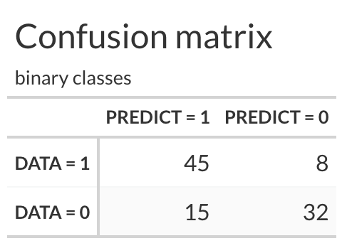
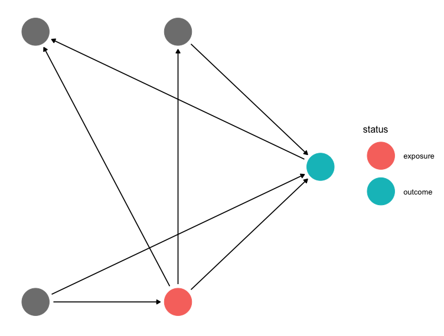
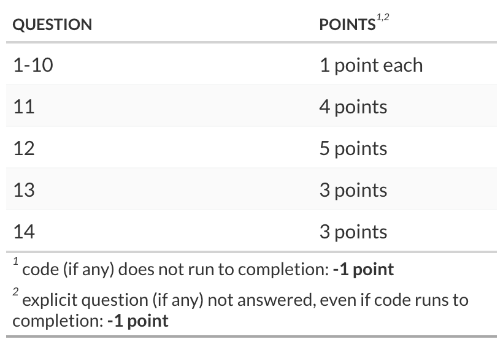

## Packages

```{r}
#| message: false
# check if 'librarian' is installed and if not, install it
if (! "librarian" %in% rownames(installed.packages()) ){
  install.packages("librarian")
}
  
# load packages if not already loaded
librarian::shelf(
  tidyverse, broom, rsample, ggdag, causaldata, halfmoon, ggokabeito, malcolmbarrett/causalworkshop
  , magrittr, ggplot2, estimatr, Formula, r-causal/propensity, gt, gtExtras, timetk, modeltime)

# set the default theme for plotting
theme_set(theme_bw(base_size = 18) + theme(legend.position = "top"))
```

# Part 1

## Q1

What is the primary purpose of the 'I' (Integrated) component in an **ARIMA** model?:

::: {#Q1 .callout-note appearance="simple" icon="false"}
## SOLUTION Q1 (1 point) :

-   To make the time series stationary through differencing
:::

## Q2

What is the main purpose of the **k-means clustering** algorithm?:

::: {#Q2 .callout-note appearance="simple" icon="false"}
## SOLUTION Q2 (1 point) :

-   To identify underlying groupings in a dataset
:::

## Q3

In the context of directed acyclic graphs (DAGs), what do **confounders** represent?:

::: {#Q3 .callout-note appearance="simple" icon="false"}
## SOLUTION Q3 (1 point) :

-   Common causes that create spurious correlations
:::

## Q4

For the binary classifier with the confusion matrix below:

{fig-align="center" width="250"}

The ***specificity (i.e. TNR)*** of this binary classifier is approximately:

::: {#Q4 .callout-note appearance="simple" icon="false"}
## SOLUTION Q4 (1 point) :

-   0.68

Specificity, or True Negative Rate (TNR), is calculated as:

$$
\text{Specificity} = \frac{\text{True Negatives (TN)}}{\text{True Negatives (TN)} + \text{False Positives (FP)}}=\frac{32}{32+15}
$$ where:

-   True Negatives (TN): The number of correctly predicted negative instances.
-   False Positives (FP): The number of negative instances incorrectly predicted as positive.

Alternatively, specificity is the number of true negatives out of all negatives. Here the number of true negatives is 32, and the number of all negatives is 47, so the specificity is 32/47 = 0.6808511 \~ 0.68.
:::

## Q5

In exponential smoothing, what does the smoothing factor (alpha) primarily control?

::: {#Q5 .callout-note appearance="simple" icon="false"}
## SOLUTION Q5 (1 point) :

-   The rate at which the model adapts to recent changes in the data
:::

## Q6

What is the purpose of an **adjustment set** in causal inference?:

::: {#Q6 .callout-note appearance="simple" icon="false"}
## SOLUTION Q6(1 point) :

-   To identify the minimum set of variables needed to block all confounding pathways
:::

## Q7

What is a common disadvantage of **lazy** machine learning learners like k-Nearest Neighbors (k-NN)?:

::: {#Q7 .callout-note appearance="simple" icon="false"}
## SOLUTION Q7 (1 point) :

-   Their performance can degrade significantly with high-dimensional data
:::

## Q8

{fig-align="center" width="673"}

How many **open paths** are in the DAG above?

::: {#Q8 .callout-note appearance="simple" icon="false"}
## SOLUTION Q8 (1 point) :

-   3

-   A path is open if it has no non-collider nodes that have been conditioned on.

-   If a collider exists along the path, conditioning on the collider (or its descendants) can open the path.

    -   Here there is one collider, there is no conditoning, and all other paths are open.

```{r}
#| label: specify the DAG  and define the order  
# specify the DAG  and define the order  
dag <- ggdag::dagify(
  Y ~ X + C1 + C2,
  C3 ~ Y + X,
  C2 ~ X,
  X ~ C1,
  coords = ggdag::time_ordered_coords(
    list(
      # time point 1
      c("C1", "C3"),
      # time point 2
      c("X","C2"),
      # time point 3
      "Y"
    )
  ),
  exposure = "X",
  outcome = "Y"
)  

dag |> dagitty::paths()
```
:::

## Q9

When is accuracy a potentially misleading metric for evaluating a classification model?:

::: {#Q9 .callout-note appearance="simple" icon="false"}
## SOLUTION Q9 (1 point) :

-   When the dataset is highly imbalanced, with one class dominating others
:::

## Q10

What is the 'naive' assumption made in Naive Bayes classification?:

::: {#Q10 .callout-note appearance="simple" icon="false"}
## SOLUTION Q10 (1 point) :

-   That the features are all independent given the class
:::

# Part 2

## Q11

Execute the following code to create simulated observational data, where `D` is the treatment variable and `Y` is the response variable.

```{r}
#| echo: true
#| message: false
#| error: false
set.seed(8740)

n <- 800
V <- rbinom(n, 1, 0.2)
W <- 3*V + rnorm(n)
D <- V + rnorm(n)
Y <- D + W^2 + 1 + rnorm(n)
Z <- D + Y + rnorm(n)
data_obs <- tibble::tibble(V=V, W=W, D=D, Y=Y, Z=Z)
```

In the code below we fit several different outcome models. Compare the resulting coefficients for `D`. Which regressions appear to lead to unbiased estimates of the causal effect? **(2 points)**

```{r}
#| echo: true
#| label: outcome models
#
extract_CI <- function(m, str){
  broom::tidy(m,conf.int = TRUE) |> 
    dplyr::slice(2) |> 
    dplyr::select(term, estimate, conf.low, conf.high) |> 
    dplyr::mutate(model = str, .before = 1)
}
# linear model of Y on X
lin_YX <- lm(Y ~ D, data=data_obs) |> extract_CI("YX")

# linear model of Y on X and V
lin_YV <- lm(Y ~ D + V, data=data_obs) |> extract_CI("YV")

# linear model Y on X and W
lin_YW <- lm(Y ~ D + W, data=data_obs) |> extract_CI("YW")

dplyr::bind_rows( lin_YX, lin_YV, lin_YW) 
```

Answer the questions below and list all valid adjustment sets for the causal structure in this data (a good first step is to sketch the causal relations between variables - you don't need **ggdag::dagify - just look at the data spec**). **(2 points)**

::: {#Q11 .callout-note appearance="simple" icon="false"}
## YOUR ANSWER Q11:

Re-estimate the coeficient on D using a **Two-step OLS** (i.e. use the FWL theorem) 

```{r}
#| label: use the FWL Theorem to re-estimate the coeficient on D
#
resid_dat <- 
  tibble::tibble(
    D_res = ( lm(D ~ W + V, data=data_obs) )$resid
    , Y_res = ( lm(Y ~ W + V, data=data_obs) )$resid
  )

lin_FWL <- lm(Y_res ~ D_res, data=resid_dat) |> extract_CI("FWL")
lin_FWL

```

1.  Regressions that appear to lead to unbiased estimates of the causal effect are: `lin_FWL` and `lin_YV`. Since Y \<- D + W\^2 + 1 + rnorm(n), the correct value is 1. The confidence intervals of `lin_YX` and `lin_YW` do not include the correct answer, so those regressions are biased. By contrast the the confidence intervals of `lin_FWL` and `lin_YV` do not include the correct answer,

2.  The best one(s) is(are) `lin_FWL` and `lin_YV` . The confidence intervals of `lin_FWL` are tighter around the correct answer, so arguably `lin_FWL` is better, but they are close, so both are acceptable.

3.  Valid adjustment sets for the data used in this question are:

```{r}
# specify the DAG for this question, based on the data generation mechanism
Q10dag <- ggdag::dagify(
  W ~ V
  , D ~ V
  , Y ~ D + W
  , Z ~ D + Y
  , exposure = "D"
  , outcome = "Y"
)
```

```{r}
# Plot the DAG
Q10dag %>% ggdag::ggdag(use_text = TRUE, layout = "time_ordered") +
  ggdag::theme_dag()
```

```{r}
Q10dag %>% ggdag::ggdag_adjustment_set(use_text = TRUE) +
  ggdag::theme_dag()
```

Here both variables V and W will block the open backdoor path from D -\> Y. Note that the Dag doesn't capture the quadratic relationship of W to Y, just that Y depends on W. The quadratic relationship is why lin_YW doesn't product a great estimate.

In practice you would note the difference between lin_YV and lin_YW and experiment with different regression specifications, e.g.:

```{r}
lm(Y ~ D + I(W^2), data=data_obs)
```
:::

## Q12

For this question we'll use the [**Spam Classification Dataset**]{.underline} available from the UCI Machine Learning Repository. It features a collection of spam and non-spam emails represented as feature vectors, making it suitable for a logistic regression model. The data is in your `data/` directory and the metadata is in the `data/spambase/` directory.

We'll use this data to create a model for detecting email spam using **a boosted tree model**.

```{r}
#| eval: true
#| message: false
spam_data <- readr::read_csv('data/spam.csv', show_col_types = FALSE) %>% 
  tibble::as_tibble() %>% 
  dplyr::mutate(type = forcats::as_factor(type))

```

\(1\) Split the data into test and training sets, and create a default recipe and a default model specification. Use the ***xgboost*** engine for the model, with **mtry** = 10 & **tree_depth** = 5. **(1 point)**

::: {.callout-note appearance="simple" icon="false"}
## SOLUTION :

```{r}
#| eval: true
#| message: false
set.seed(8740)

# create test/train splits
splits <- rsample::initial_split(spam_data)
train <- rsample::training(splits)
test <- rsample::testing(splits)

default_recipe <- train %>%
  recipes::recipe(formula = type ~ .)
  
default_model <- parsnip::boost_tree(mtry = 10, tree_depth = 5) |> 
  parsnip::set_engine("xgboost") %>%
  parsnip::set_mode("classification")
```
:::

\(2\) create a default workflow object with the recipe and the model specification, fit the workflow using `parnsip::fit` and the **training** data, and then generate the testing results by applying the fit to the **testing** data using `broom::augment` . **(1.5 point)**

::: {.callout-note appearance="simple" icon="false"}
## SOLUTION :

```{r}
#| eval: true
#| message: false
default_workflow <- workflows::workflow() %>%
  workflows::add_recipe(default_recipe) %>%
  workflows::add_model(default_model)
  
lm_fit <- default_workflow %>%
  parsnip::fit(train)

testing_results <- broom::augment(lm_fit , test)

```
:::

\(3\) Evaluate the testing results by plotting the **roc_auc curve**, and calculating the **accuracy**. **(1 point)**

::: {.callout-note appearance="simple" icon="false"}
## SOLUTION :

```{r}
#| eval: true
#| message: false
# ROC_AUC PLOT
testing_results %>% 
    yardstick::roc_curve(
    truth = type
    , .pred_spam
    ) %>%
  ggplot2::autoplot() +
  ggplot2::theme_bw(base_size = 18)

```

```{r}
# CALCULATION OF ACCURACY
testing_results |> 
    yardstick::roc_auc(
    truth = type
    , .pred_spam
    )
```
:::

\(4\) Take your fitted model and extract the fit using `(lm_fit |> workflows::extract_fit_parsnip())$fit`, and then compute the feature importance matrix and identify the most important feature. **(1.5 points)**

::: {.callout-note appearance="simple" icon="false"}
## SOLUTION :

```{r}
#| label: identify the leading feature in classifying emails as spam/nonspam
#| message: false
#
# extract the model from the workflow fit
booster <- (lm_fit |> workflows::extract_fit_parsnip())$fit 

# create the importance matrix 
importance_matrix <- 
  xgboost::xgb.importance(model = (lm_fit |> workflows::extract_fit_parsnip())$fit )

importance_matrix |> head()

```

-   the most important feature is: `charExclamation`
:::

## Q13

1.  When preprocessing data for time series models, what is the function `recipes::step_lag()` used for? **(1.5 points)**

2.  Give an example of its use in a recipe that is engineered by use with weekly data records. **(1.5 points)**

::: {.callout-note appearance="simple" icon="false"}
## SOLUTION:

-   The `recipes::step_lag()` function **creates a *specification* of a recipe step that will add new columns of lagged data. Lagged data will by default include NA values where the lag was induced**.

-   An example of its use in a recipe that is engineered for use with weekly data records is:

```{r}
# Sample weekly data
set.seed(123)
weekly_data <- tibble(
  date = seq(as.Date("2023-01-01"), by = "week", length.out = 52),
  sales = 100 + 10 * sin(2 * pi * seq(1, 52) / 52) + rnorm(52, sd = 5)
)

# Create a recipe
rec <- recipes::recipe(sales ~ date, data = weekly_data) %>%
  # Add Lag terms in the sales variable, for use as a predictor.
  # Many lags could be created. Here a single lag of one week is created
  recipes::step_lag(sales, lag=1)  # lag sales data by one week

# Prepare and bake the recipe to see the engineered features
rec_prep <- recipes::prep(rec)
weekly_data_with_lag <- recipes::bake(rec_prep, new_data = NULL)

weekly_data_with_lag
```

A description of the first few rows of the data after the prep and bake steps: The columns are `date`, `sales`, and **`lag_1_sales`** , and in the first row, the `lag_1_sales` value is NA. The second has no NA values, and the value of `lag_1_sales` is equal to the value of sales the week prior.
:::

## Q-14

A peer-reviewed paper by researchers at the Harvard Medical School, UCLA School of Medicine, and the Department of Emergency Medicine at the University of Michigan (Robert Yeh et al., 2018) has the following abstract describing the work and its results:

{fig-align="center"}

::: {#Q14 .callout-note appearance="simple" icon="false"}
## SOLUTION (3 points) Q14:

As a causal analysis this is a randomized controlled trial which should identify the causal effect, if any.

However, while the study purports to evaluate the impact of parachutes on the risk of death or major injury, there is no or minimal exposure to the risk when jumping from an airplane at a height of 0.6 meters.

This study was published in a respected journal, but it was meant as a parody of many of the studies that claimed to identify the effect of wearing masks on the risk of contracting Covid, i.e. studies with a surface rigor, but of little use since the risk mitigated was minimal.
:::

# Grading (25 pts)

#### Total points available: 25 points.

{fig-align="center" width="600"}
