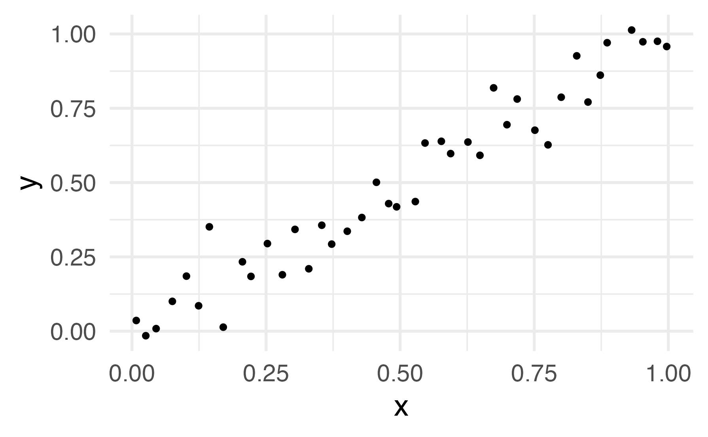

## Packages

```{r}
#| message: false
# check if 'librarian' is installed and if not, install it
if (! "librarian" %in% rownames(installed.packages()) ){
  install.packages("librarian")
}
  
# load packages if not already loaded
librarian::shelf(
  ggplot2, magrittr, tidymodels, tidyverse, rsample, broom, recipes, parsnip, modeldata
)

# set the efault theme for plotting
theme_set(theme_bw(base_size = 18) + theme(legend.position = "top"))
```

# Quiz-1 (part 1)

## Q-1

Is this data a `tidy` dataset?

| Region    | \< \$1M | \$1 - \$5M | \$5 - \$10M | \$10 - \$100M | \> \$100M |
|-----------|---------|------------|-------------|---------------|-----------|
| N America | \$50M   | \$324M     | \$1045M     | \$941M        | \$1200M   |
| EMEA      | \$10M   | \$121M     | \$77M       | \$80M         | \$0M      |

*Delete the wrong answer:*

::: {.callout-note appearance="simple" icon="false"}
## SOLUTION: the answer is No

The values of categories appear as column names, while the corresponding dollar values are spread out across the tables. The Tidy version would have three columns - *Region, income_range, and dollar value* so that all measurements that go together can be found in a row.

This could be achieved by transforming the original table using `tidyr::pivot_longer()`
:::

```{r}
#| label: show the original table
# original table
dat <- tibble::tibble(
  Region = c('N America', 'EMEA')
  , '< $1M' = c('$50M', '$10M')
  , '$1 - $5M' = c('$324M', '$121M')
  , '$5 - $10M' = c('$1045M', '$77M')
  , '$10 - $100M' = c('$941M', '$80M')
  , '> $100M' = c('$1200M', '$0M')
) 
dat |> gt::gt() |> gtExtras::gt_theme_espn()
```

```{r}
#| label: show the transformed table in tidy format
# transformed table
dat |> 
  tidyr::pivot_longer(-Region, names_to = "range", values_to = "$ amount")|> 
  gt::gt() |> gtExtras::gt_theme_espn()
```

## Q-2

Which resampling method from the `resample::` package randomly partitions the data into V sets of roughly equal size?

::: {.callout-note appearance="simple" icon="false"}
## SOLUTION: The answer is V-fold cross-validation

V-fold cross-validation (also known as k-fold cross-validation) randomly splits the data into V groups of roughly equal size (called "folds"). In the tidyverse you create a dataset for V-fold cross-validation using `rsample::vfold_cv()` .
:::

## Q-3

If I join the *two* tables below as follows:

``` r
dplyr::????_join(employees, departments, by = "department_id")
```

which type of join would include **employee_name == Moe Syzslak**?

::: {.callout-note appearance="simple" icon="false"}
## SOLUTION: the answer is `left_join`

Inner join will return all the rows with common **department ID**, and since **Moe Syzslak** has a NA **department ID**, with no match in the **department ID table**,his name won't appear in the result of the join.

Right join will return the **departments** table and all the rows of **employees** with **department ID** in common with the **departments** table, and since Moe Syzslak has a NA **department ID**, with no match in the **department ID table**,his name won't appear in the result of the join.

Left join will return the **employees** table and all the rows of **departments** with **department ID** in common with the **employees** table. Since Moe Syzslak appears in the **employees table** his name will appear in the result of the join. Since

See the code below.
:::

-   inner
-   left
-   right
-   all of the above

*Delete the incorrect answers*.

**employees** - This table contains each employee's ID, name, and department ID.

| id  | employee_name | department_id |
|-----|---------------|---------------|
| 1   | Homer Simpson | 4             |
| 2   | Ned Flanders  | 1             |
| 3   | Barney Gumble | 5             |
| 4   | Clancy Wiggum | 3             |
| 5   | Moe Syzslak   | NA            |

**departments** - This table contains each department's ID and name.

| department_id | department_name          |
|---------------|--------------------------|
| 1             | Sales                    |
| 2             | Engineering              |
| 3             | Human Resources          |
| 4             | Customer Service         |
| 5             | Research And Development |

```{r}
#| echo: true
#| layout-nrow: 3
#| label: create the two tables in Q3 and left join
tbl1 <- tibble::tribble(
~id	, ~employee_name,	~department_id
,1	,'Homer Simpson'	,4
,2	,'Ned Flanders'	  ,1
,3	,'Barney Gumble'	,5
,4	,'Clancy Wiggum'	,3
,5	,'Moe Syzslak'	  ,NA
)

tbl2 <- tibble::tribble(
~department_id	,~department_name
,1	,"Sales"
,2	,"Engineering"
,3	,"Human Resources"
,4	,"Customer Service"
,5	,"Research And Development"
)

# left_join
dplyr::left_join(tbl1,tbl2,by = "department_id") |> 
  gt::gt() |> gt::tab_header(title = "Left Join") |> 
  gtExtras::gt_theme_espn()
```

```{r}
#| label: take the two tables in Q3 and right join
# right_join
dplyr::right_join(tbl1,tbl2,by = "department_id") |> 
  gt::gt() |> gt::tab_header(title = "Right Join") |> 
  gtExtras::gt_theme_espn()
```

```{r}
#| label: take the two tables in Q3 and inner join
# inner_join
dplyr::inner_join(tbl1,tbl2,by = "department_id") |> 
  gt::gt() |> gt::tab_header(title = "Inner Join") |> 
  gtExtras::gt_theme_espn()
```

## Q-4

Recall that the first step of a decision-tree **regression** model will divide the space of predictors into 2 parts and estimate constant prediction values for each part. For a single predictor, the result of the first step estimates the outcome as:

$$
\hat{y} =\sum_{i=1}^{2}c_i\times I_{(x\in R_i)}
$$such that

$$
\text{SSE}=\left\{ \sum_{i\in R_{1}}\left(y_{i}-c_{i}\right)^{2}+\sum_{i\in R_{2}}\left(y_{i}-c_{i}\right)^{2}\right\} 
$$

is minimized.

On the first split of a decision tree **regression** model for the following data:

{fig-align="center"}

The first two regions that partition $x$ will be (Delete the wrong answer(s) below):

::: {.callout-note appearance="simple" icon="false"}
## SOLUTION: the answer is \[0,1/2\] and (1/2, 2/2\]

Since the decision tree is minimizing the SSE at each split, you want to minimize the range (max-min) of y values in each split. You can find a $c_i$ value to minimize the SSE within each split, but a wider range of $y$ values will have a larger SSE than a smaller range of $y$ values, due to the squares, and so the splits should have equal ranges.

Since it looks like $y_i = x_i + e_i$ (where $e_i$ is an error term), equal x ranges will give equal y ranges, so the split should be \[0,1/2\] and (1/2, 2/2\].
:::

## Q-5

In an ordinary linear regression, regressing the outcome $y$ on a single predictor $x$, the regression coefficient can be estimated as:

::: {.callout-note appearance="simple" icon="false"}
## SOLUTION:

In class we showed that the regression coefficient can be estimated as

$$
\displaystyle\frac{\text{covar(x,y)}}{\text{var(x)}}
$$
:::

# Quiz-1 (part 2)

## Q6

Write code to determine the number of **species** of penguin in the dataset. How many are there?

::: {.callout-note appearance="simple" icon="false"}
## SOLUTION: there are 3 penguin species in the dataset

```{r}
#| echo: true
#| label: list the distinct species and use the count
palmerpenguins::penguins |> 
  dplyr::distinct(species)
```

```{r}
#| echo: true
#| label: pull the species column and apply the 'unique' function
# == OR ==
palmerpenguins::penguins$species |>  
  unique() |> length()
```
:::

## Q7

Execute the following code to read sales data from a csv file.

```{r}
#| echo: true
#| message: false
#| error: false
#| label: read sales data, clean names and create dates

# read sales data
sales_dat <-
  readr::read_csv("data/sales_data_sample.csv", show_col_types = FALSE) |>
  janitor::clean_names() |> 
  dplyr::mutate(
    orderdate = lubridate::as_date(orderdate, format = "%m/%d/%Y %H:%M")
    , orderdate = lubridate::year(orderdate)
  )

```

Describe what the `group_by` step does in the **code below**, and complete the code to produce a sales summary by year, i.e. a data.frame where `productline` and `orderdate` are the columns (one column for each year), while each year column contains the sales for each `productline` that year.

```{r}
#| eval: false
#| message: false
#| label: group by orderdate and productline, summarize sales and pivot table
  sales_dat |> 
    dplyr::group_by(orderdate, productline) |> 
    dplyr::summarize( sales = sum(___) ) |> 
    tidyr::pivot_wider(names_from = ___, values_from = ___)
```

::: {.callout-note appearance="simple" icon="false"}
## SOLUTION:

-   the result of the **`group_by`** step is: order first by the values of the `orderdate` column, and then, within each `orderdate` value, order the rows by the values of the `productline` column.

-   the sales summary table produced by the code is given below

```{r}
#| eval: true
#| message: false
#| label: sales table solution
# executed code
sales_dat |> 
    dplyr::group_by(orderdate, productline) |> 
    dplyr::summarize( sales = sum(sales) ) |> 
    tidyr::pivot_wider(names_from = orderdate, values_from = sales)
```
:::

## Q8

For the data below, it is expected that the response variable $y$ can be described by the independent variables $x1$ and $x2$. This implies that the parameters of the following model should be estimated and tested per the model:

$$
y = \beta_0 + \beta_1x1 + \beta_2x2 + \epsilon, \epsilon ∼ \mathcal{N}(0, \sigma^2)
$$

```{r}
dat <- tibble::tibble(
  x1=c(0.58, 0.86, 0.29, 0.20, 0.56, 0.28, 0.08, 0.41, 0.22, 0.35, 0.59, 0.22, 0.26, 0.12, 0.65, 0.70, 0.30
        , 0.70, 0.39, 0.72, 0.45, 0.81, 0.04, 0.20, 0.95)
  , x2=c(0.71, 0.13, 0.79, 0.20, 0.56, 0.92, 0.01, 0.60, 0.70, 0.73, 0.13, 0.96, 0.27, 0.21, 0.88, 0.30
        , 0.15, 0.09, 0.17, 0.25, 0.30, 0.32, 0.82, 0.98, 0.00)
  , y=c(1.45, 1.93, 0.81, 0.61, 1.55, 0.95, 0.45, 1.14, 0.74, 0.98, 1.41, 0.81, 0.89, 0.68, 1.39, 1.53
        , 0.91, 1.49, 1.38, 1.73, 1.11, 1.68, 0.66, 0.69, 1.98)
)
```

Calculate the parameter estimates ( $\hat{\beta}_0$, $\hat{\beta}_1$, and $\hat{\beta}_2$); in addition find the usual 95% confidence intervals for $\beta_0$, $\beta_1$, $\beta_2$.

::: {.callout-note appearance="simple" icon="false"}
## SOLUTION:

Using broom::tidy(conf.int = TRUE) with a regression model:

```{r}
#| echo: true
#| label: run a regression and tidy the results
# your code goes here
fit_Q8 <- lm(y ~ ., data = dat)
fit_Q8 |> broom::tidy(conf.int = TRUE) |> 
  gt::gt() |> gtExtras::gt_theme_espn()
```
:::

## Q9

Using the `.resid` column created by `broom::augment(___, dat)` , calculate $\hat{\sigma}^2$.

::: {.callout-note appearance="simple" icon="false"}
## SOLUTION: the variance of the residual is 0.0116

```{r}
#| echo: true
#| label: fit data and augment data with the results
broom::augment(fit_Q8, dat) |> 
  dplyr::pull(.resid) |> 
  var()
```
:::

## Q10

Does the following code train a model on the full training set of the `modeldata::ames` housing dataset and then evaluate the model using a test set?

1.  Is any step missing?

2.  When the recipe is baked and prepped, do you think all categories will be converted to dummy variables and all numeric predictors will be normalized?

::: {.callout-note appearance="simple" icon="false"}
## SOLUTION:

```{r}
#| echo: true
#| label: load data, split and create recipe
# Load the ames housing dataset
data(ames)

# Create an initial split of the data
set.seed(123)
ames_split <- initial_split(ames, prop = 0.8, strata = Sale_Price)
ames_train <- training(ames_split)
ames_test  <- testing(ames_split)

# Create a recipe
ames_recipe <- recipe(Sale_Price ~ ., data = ames_train) |>
  step_log(Sale_Price, base = 10) |>  
  step_dummy(all_nominal_predictors()) |>  
  step_zv(all_predictors()) |> 
  step_normalize(all_numeric_predictors())  
```

```{r}
#| echo: true
#| eval: false
#| label: create workflow, fit and collect metrics
# Create a workflow
ames_workflow <- workflow() |>
  add_recipe(ames_recipe) |>
  add_model(lm_spec)

# Fit the model and evaluate on the test set
ames_fit <- ames_workflow |> last_fit(ames_split)

# View the metrics
ames_fit |> collect_metrics()
```

1.  If you run the code chunk above you will get an error error, "**'lm_spec' is missing**". A workflow requires a pre-processing step (by formula or recipe) and a model specification. That is what is **missing** here.

2.  Looking at the data in the ames dataset, there are 40 factor variables and 34 numeric variables.

```{r}
#| echo: true
skim_data <- ames |> skimr::skim()
skim_data$skim_type |> table()
```

The author of the recipe (see below) likely wanted the **factor variables to be converted to dummy variables**, and the **numeric variables to be normalized**.

However, the order of the steps in the recipe turns the factor variables into dummy variables [**before**]{.underline} the numeric variable were normalized, and dummy variables are numeric. Given the order of the steps, all the dummy variables will be normalized and all variables will be normalized numeric variables.

No dummy variables remain after the **bake** operation!

```{r}
#| echo: true
ames_recipe |> prep() |> 
  bake(new_data = ames) |> 
  dplyr::glimpse()
```

The code used in this question was [**written by chatGPT**]{.underline}. Use these tools with caution.
:::

# Grading (10 pts)

| **Part**                | **Points** |
|:------------------------|:----------:|
| **Part 1 - Conceptual** |     5      |
| **Part 2 - Applied**    |     5      |
| **Total**               |     10     |
