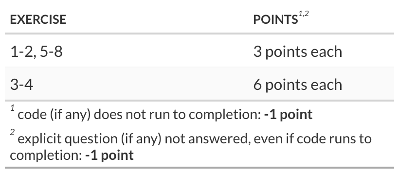

```{r}
#| message: false
#| warning: false
#| echo: false
# check if 'librarian' is installed and if not, install it
if (! "librarian" %in% rownames(installed.packages()) ){
  install.packages("librarian")
}
  
# load packages if not already loaded
librarian::shelf(
  tidyverse, broom, rsample, ggdag, causaldata, halfmoon, ggokabeito
  , magrittr, ggplot2, estimatr, Formula, r-causal/propensity, gt, gtExtras
  , r-causal/causalworkshop, ggplot2)

# set the default theme for plotting
theme_set(theme_bw(base_size = 18) + theme(legend.position = "top"))
```

## Q1

Recall that in our last lecture we used several methods to understand the effect of nets on Malaria risk. The regression adjustment approach gave results that were lower than those using IPW or Doubly Robust Estimation.

This is partly due to the regression specification we used, which as a second-order, fixed effects model did not fully capture the relationship between the covariates and the outcome. One simple way to enhance the model is to relax the fixed effects assumption, which you will do here, in the context of a completely different approach.

#### g-computation

The g-computation method (*g for general*) is good to know because it works for both binary/discrete treatments and continuous treatments

```{r}
dat_ <- causalworkshop::net_data |> dplyr::mutate(net = as.numeric(net))
```

In this question we'll use g-computation to estimate the effect of net use on Malaria risk. Run the following steps:

1.  Make two copies of the data. Keep the original copy (you'll have three in total).
2.  Mutate the copied data so that **one copy has net == 1** and the **other copy has net ==0**.
3.  Bind the data together by row to produce a test dataset.
4.  Model the relationship between net use and malaria risk, incorporating all confounders. The linear model from the lecture is a good start. Fit the model with the original data.
5.  Use the model to predict the outcomes in the test dataset.
6.  Group the test dataset by net use, compute the average outcome by group (the effect), and find the difference in effects.

::: {#Q1 .callout-note appearance="simple" icon="false"}
## SOLUTION Q1:

```{r}
# copy data
# mutate data to fix treatment (one of each) & bind data into single dataset
dat_stacked <-
  dplyr::bind_rows(
    dat_ |> dplyr::mutate(net = 1)
    , dat_ |> dplyr::mutate(net = 0)
  )
```

```{r}
# Model the outcome, and fit it using the original (unmutated) data
risk_model_net_fit <- glm(
  malaria_risk ~ (net + income + health + temperature + insecticide_resistance)^2, data = dat_)

risk_model_net_fit |> broom::tidy()
```

```{r}
# Use the model fit to predict the outcomes in the test data
predictions <-
  risk_model_net_fit |>
  broom::augment(newdata = dat_stacked, type.predict = "response")
```

```{r}
# average the predicted outcomes and compute the contrast.
predictions |>
  dplyr::group_by(net) |>
  dplyr::summarize(mean_malaria_risk = mean(.fitted)) |>
  dplyr::mutate(contrast = mean_malaria_risk - dplyr::lag(mean_malaria_risk))
```

The contrast between using a net and not using a net is a -13.02 reduction in malaria risk
:::

In summary the g-computation is as follows

-   Fit a standardized model with all covariates/confounders. Then, use cloned data sets with values set on each level of the exposure you want to study.
-   Use the model to predict the values for that level of the exposure and compute the effect estimate of interest.

## Q2

Suppose you work for a big tech company and you want to estimate the impact of a billboard marketing campaign on in-app purchases. When you look at data from the past, you see that the marketing department tends to spend more to place billboards in cities where the purchase level is lower. This makes sense because they wouldn’t need to do lots of advertisement if sales were skyrocketing. If you run a regression model on this data, it looks like higher cost in marketing leads to lower in-app purchase amounts, but only because marketing investments are biased towards low spending regions.

```{r}
#| eval: true
toy_panel <-tibble::tibble(
    "mkt_costs" = c(5,4,3.5,3, 10,9.5,9,8, 4,3,2,1, 8,7,6,4),
    "purchase" = c(12,9,7.5,7, 9,7,6.5,5, 15,14.5,14,13, 11,9.5,8,5),
    "city" = 
      c("Windsor","Windsor","Windsor","Windsor"
        , "London","London","London","London"
        , "Toronto","Toronto","Toronto","Toronto", "Tilbury","Tilbury","Tilbury","Tilbury")
)

fit_lm <- lm(purchase ~ mkt_costs, data = toy_panel)

toy_panel |> 
  ggplot(aes(x = mkt_costs, y = purchase)) +
  geom_point(color = 'blue') +
  geom_abline(slope = fit_lm$coefficients[2], intercept = fit_lm$coefficients[1], color = 'purple') +
  labs(title = "Simple OLS Model", x = "Marketing Costs (in 1000)", y = "In-app Purchase (in 1000)") +
  theme_minimal()
```

Knowing a lot about causal inference (and Simpson's Paradox), you decide to run a fixed effect model, adding the city’s indicator as a dummy variable to your model. The fixed effect model controls for city specific characteristics that are constant in time, so if a city is less open to your product, it will capture that. When you run that model, you can finally see that more marketing costs leads to higher in-app purchase.

::: {#Q2 .callout-note appearance="simple" icon="false"}
## SOLUTION Q2:

```{r}
#| eval: true
#| label: toy-panel fixed effects

# mutate the data to make the column 'city' a factor
toy_panel <- toy_panel |> dplyr::mutate(city = factor(city))


# fit the data using the new data and augment with predictions
fe <- lm(purchase ~ mkt_costs + city, data = toy_panel)


# augment the fit with predictions
fe_toy <- fe |> broom::augment(newdata = toy_panel)
```

```{r}
# plot the data points
p <- fe_toy |> 
  ggplot(aes(x = mkt_costs, y = purchase, color  = city)) +
  geom_point() + 
  labs(title = "Fixed Effect Model", x = "Marketing Costs (in 1000)", y = "In-app Purchase (in 1000)") +
  theme_minimal() 

  intcpt <- fe$coefficients[1]; slp = fe$coefficients[2]
  for ( inc in c(0,fe$coefficients[-c(1,2)]) ){
    p <- p + geom_abline(slope = slp, intercept = intcpt + inc, color = 'purple') 
  }
p
```

Take a minute to appreciate what the image above is telling you about what fixed effect is doing. Notice that fixed effect is fitting one regression line per city. Also notice that the lines are parallel. The slope of the line is the effect of marketing costs on in-app purchase. So the fixed effect is assuming that the causal effect is constant across all entities, which are cities in this case. This can be a weakness or an advantage, depending on how you see it. It is a weakness if you are interested in finding the causal effect per city. Since the FE model assumes this effect is constant across entities, you won’t find any difference in the causal effect. However, if you want to find the overall impact of marketing on in-app purchase, the panel structure of the data is a very useful leverage that fixed effects can explore.
:::

## Q3

You are an advanced-analytics analyst working at a private equity firm. One of the partners, an MBA by training, has suggested that the firm eliminate portfolio companies that are run by their founders or their families, on the basis that these firms do not have professional management (i.e. poor management quality).

```{r}
#| code-fold: true
#| code-summary: portfolio data
#| label: portfolio data
data <- readr::read_csv("data/portfolio_companies.csv", show_col_types = FALSE)
```

The partner opened the data on the portfolio companies in excel and did a simple calculation, the equivalent of the following:

```{r}
#| code-fold: true
#| code-summary: management score difference
data |>
  dplyr::group_by(foundfam_owned) |>
  dplyr::summarise (
    "mean management score" = mean(management)
    , "management score stdev" = sd(management)
  ) |> 
  dplyr::mutate(delta = `mean management score` - dplyr::lag(`mean management score`))
```

The partner concluded that the portfolio firms that are run by their founders or their families result in a management quality that is worse (per the management score) in comparison to other portfolio firms, a significant difference - almost 2/3 of a standard deviation worse.

You, being an **advanced**-analytics analyst, gently suggest that this is a question of causality, and that there may be other factors related to both firm ownership and management quality that bias the management score. The other partners all agree, and ask you to estimate the real effect of firm ownership type on management quality.

So you start by interviewing the partners and other to identify other factors, particularly those that might be related to variations in either ownership structure or management quality.

#### Potential variables

One source of variation in ownership is how a firm starts, whether they were started by a founder or perhaps they were spin-offs, joint ventures, or affiliates of other companies. You don't have this kind of data, but you do have data on the production technology the firm uses. Some technologies are very capital intensive, so they are unlikely to be used by start-ups, even those that become successful. So the technology a firm uses is a source of variation in ownership.

Whether firms start as founder-owned or involve outside owners also depend on cultural or institutional factors in society. This may be important in data collected from firms in many countries, and even within countries. Similar factors may affect management quality.

Some founder/family businesses are sold to investors, so variation may depend on supply and demand (i.e. the level of M&A business). Firm size and age may also be a factor in whether a firm is acquired.

Similarly the competition in the industry may be a factor in both ownership and management quality, as highly competitive industries may have fewer founder owned firms and better management quality.

You build a DAG to represent these assumptions, as follows:

```{r}
#| code-fold: true
#| code-summary: business DAG
#| label: business DAG
#| fig-width: 8.2
#| fig-align: center
set.seed(3534)
set.seed(534)

fq_dag <- ggdag::dagify(
  mq ~ ff + m + c + ci + ct,
  ff ~ c + ct + ci + fsa + fc,
  m ~ ff,
  es ~ mq + ff,
  #fsa ~ mq,
  exposure = "ff",
  outcome = "mq",
  labels = c(
    mq = "management_quality",
    ff = "founder_family",
    m = "managers",
    fsa = "firm_size_age",
    c = "competition",
    ci = "culture_institutions",
    ct = "complex_technology",
    fc = "family_circumstances",
    es = "export share"
  )
)

fq_dag |>
  ggdag::tidy_dagitty() |> 
  ggdag::node_status() |>
  ggplot(
    aes(x, y, xend = xend, yend = yend, color = status)
  ) +
  ggdag::geom_dag_edges() +
  ggdag::geom_dag_point() +
  ggdag::geom_dag_label_repel(aes(label = label)) +
  ggokabeito::scale_color_okabe_ito(na.value = "darkgrey") +
  ggdag::theme_dag() +
  theme(legend.position = "none") +
  coord_cartesian(clip = "off")
```

#### Data

Next you look for data that can measure the causal factors in your DAG. You have the following data:

-   employment count
-   age of firm
-   proportion of employees with a college education (except management)
-   level of competition
-   industry classification
-   country of origin
-   share of exports in sales

Of these:

-   industry can be used as a measure of technology complexity, as is the share of college educated employees.
-   number of competitors is a measure of competition strength
-   the country of origin is a measure of cultural and institutional factors
-   the number of employees is a measure of firm size
-   the age of the firm is missing for about 14% of the observations

You have data for the share of exports in sales, but as it is a collider you decide not to condition on this variable in your analysis.

```{r}
#| label: read the data
dat_portfolio <- readr::read_csv('data/portfolio_companies.csv', show_col_types = FALSE)
```

```{r}
#| label: group by whether family-owned, compute mean score and compare the two groups
data |> 
  group_by(foundfam_owned) |>  
  summarise (mean(management))  |> 
  dplyr::mutate(delta = `mean(management)` - dplyr::lag(`mean(management)`))
```

Here are the variables you have decided to use in your analysis:

```{r}
#| label: analytic variables

Y <- "management"
D <- "foundfam_owned"

control_vars <- c("degree_nm", "degree_nm_sq", "compet_moder", "compet_strong", 
                  "lnemp", "age_young", "age_old", "age_unknown")
control_vars_to_interact <- c("industry", "countrycode")
X <- c(control_vars, control_vars_to_interact)
```

And here are the formulas for the models you have decided to test:

```{r}
#| label: model formulas

# basic model without confounders
formula1 <- as.formula(paste0(Y, " ~ ",D))

# basic model with confounders
formula2 <- as.formula(paste0(Y, " ~ ",D," + ", 
                  paste(X, collapse = " + ")))

# model with interactions between variables
formula3 <- as.formula(paste(Y, " ~ ",D," + ", 
	paste(control_vars_to_interact, collapse = ":"), 
	" + (", paste(control_vars, collapse = "+"),")*(",
	paste(control_vars_to_interact, collapse = "+"),")",sep=""))
```

::: {#Q3 .callout-note appearance="simple" icon="false"}
## SOLUTION Q3:

```{r}
#| label: fit each formula
#
ols1 <- lm(as.formula(formula1), data = dat_portfolio) 

ols2 <- lm(as.formula(formula2), data = dat_portfolio) 

ols3 <- lm(as.formula(formula3), data = dat_portfolio) 
```

```{r}
#| label: extract the estimated effect per each formula
#
list(ols1, ols2, ols3) |> 
  purrr::map(
    (\(x){
      x |> broom::tidy() |> 
        dplyr::slice(2) |> 
        dplyr::select(1:3) |> 
        dplyr::bind_cols(
          x |> broom::glance() |> 
            dplyr::select(c(ends_with("r.squared"), AIC, BIC))
        )
    })
  ) |> dplyr::bind_rows()
```

Considering the trade-off between model fit and model complexity, the most suitable model is `ols2`

Having settled on a formula/model, use the doubly-robust effect estimation function from class to

1.  estimate the causal effect using the best model.
2.  calculate the confidence intervals on the effect

```{r}
#| label: double robust estimate

doubly_robust <- function(df, X, D, Y){
  ps <- # propensity score
    as.formula(paste(D, " ~ ", paste(X, collapse= "+"))) |>
    stats::glm( data = df, family = binomial() ) |>
    broom::augment(type.predict = "response", data = df) |>
    dplyr::pull(.fitted)
  
  lin_frml <- formula(paste(Y, " ~ ", paste(X, collapse= "+")))
  
  idx <- df[,D] |> dplyr::pull(1) == 0
  mu0 <- # mean response D == 0
    lm(lin_frml, data = df[idx,]) |> 
    broom::augment(type.predict = "response", newdata = df[,X]) |>
    dplyr::pull(.fitted)
  
  idx <- df[,D] |> dplyr::pull(1) == 1
  mu1 <- # mean response D == 1
    lm(lin_frml, data = df[idx,]) |>  
    broom::augment(type.predict = "response", newdata = df[,X]) |> 
    dplyr::pull(.fitted)
  
  # convert treatment factor to integer | recast as vectors
  d <- df[,D] |> dplyr::pull(1) |> as.character() |> as.numeric()
  y <- df[,Y] |> dplyr::pull(1)
  
  mean( d*(y - mu1)/ps + mu1 ) -
    mean(( 1-d)*(y - mu0)/(1-ps) + mu0 )
}

# estimate the effect
dat_portfolio |> 
  doubly_robust(X, D, Y)
```

```{r}
#| label: create bootstrap samples
bootstrapped_dat_portfolio <- rsample::bootstraps(
  dat_portfolio,
  times = 100,
  #strata = industry,
  # required to calculate CIs later
  apparent = TRUE
)
```

```{r}
#| label: calculate effect estimates
# NOTE: this will take a while
results_dat_portfolio <- bootstrapped_dat_portfolio |>
  dplyr::mutate(
    dre_estimate = 
      purrr::map_dbl(
        splits
        , (\(x){
            rsample::analysis(x) |> 
              doubly_robust(X, D, Y)
        })
      )
  )

# summarize as bootstrap CI estimates
results_dat_portfolio |> 
  dplyr::summarise(
  mean = mean(dre_estimate)
  , lower_ci = quantile(dre_estimate, 0.025)
  , upper_ci = quantile(dre_estimate, 0.975)
)
```

#### Omitted variables and bias

If all potential confounders are captured and included in the models, then we can put the expected effect of changing ownership within our 95% confidence intervals we calculated.

However, we suspect that we do not have a full set of confounders in the data set, either because our measurements don't capture all the variation due to a variable or because we just don't have the data at all.

For example, we don't have information on the the city the business is located in; being in a large city may make a business more attractive to outside investors, reducing the number of family-owned business while making the quality of family-owned businesses better. If this assumption is correct, then without this variable/data in the model, our estimate will be negatively biased and the effect is probably weaker than suggested by our estimates.

If other omitted variables behaved the same way we would see an even smaller effect.

Given your estimated effect and considering omitted variable bias, please provide two bullet points about your analysis for the partners:

-   [**bullet #1**]{.underline}: Given the data available, the estimated causal effect of ownership is roughly half of the average management score difference between founder/family-owned firms and other firms.
-   [**bullet #2**]{.underline}: Not all potential confounders are included in the data, which we think biases the estimate negatively. Thus the true effect is likely smaller than the estimated effect (in absolute value).
:::

## Q4

Your firm has a customer intervention that management would like to evaluate. The data from a test of the intervention is as follows (where $D$ is the (binary intervention, $Y$ is the outcome (in units of \$1,000 dollars), and $X_1,\ldots,X_5$ are variables in the adjustment set). Each row in the data represents measurements for a distinct customer:

```{r}
set.seed(8740)
n <- 2000; p <- 5;

test_dat <- matrix(rnorm(n * p), n, p, dimnames = list(NULL, paste0("X",1:p)) ) |>
  tibble::as_tibble() |>
  dplyr::mutate(
    D = rbinom(n, 1, 0.5) * as.numeric(abs(X3) < 2)
    , Y = pmax(X1, 0) * D + X2 + pmin(X3, 0) + rnorm(n)
  )
```

Estimate the ATE as follows (hint: it is \>0):

::: {#Q4 .callout-note appearance="simple" icon="false"}
## SOLUTION Q4:

```{r}
#| eval: true
# (1) using regression adjustment, with formula Y ~ D*X1 + X2 + X3 + X4 + X5
ols <- lm(Y~D*X1 + X2 + X3 + X4 + X5, data = test_dat)

# (2) using doubly robust estimation
dre <- doubly_robust(test_dat, paste0("X",1:p), "D", "Y")

```

```{r}
# summarize results
tibble::tibble(
  dre_ATE = dre
  , ols_ATE = 
    ols |> broom::tidy() |> 
    dplyr::filter(term == "D") |> 
    dplyr::pull(estimate)
)
```

Given that the ATE is \>0, the firm would like to roll out the intervention with 1,000 new customers, and the project is budgeted as follows

-   cost of the intervention is \$100 (i.e. cost = 0.1 in the scale of the data).
-   the per-customer average incremental revenue on making the intervention is $(\textrm{ATE}-0.1)\times 1000$.

Given the substantial return on the investment, the budget is approved and the firm decides to implement the intervention with the 1,000 new customers.

However, the firm's good fortune is that you are in the room with management, and you suggest an alternative strategy, based on predicting the individual treatment effects for each new customer using the customer data.

The new customer data is:

```{r}
#| label: new customer data Q4
new_dat <- 
  matrix(rnorm(n * p), n, p, dimnames = list(NULL, paste0("X",1:p)) ) |>
  tibble::as_tibble() 
```

You analyse your strategy for management as follows:

1.  make two copies of the new data; mutate one to add a column D=1 and mutate the other to add a column D=0, and

2.  take the regression model used to estimate the ATE, and predict the treatment effects for each customer, using the two data sets from steps 1 (i.e. use broom::augment with each dataset),

3.  select the columns with the predicted responses from each dataset and bind them columnwise. Name the columns r1 (response when D=1) and r0 (response when D=0). Then

    1.  mutate to compute the contrast r1-r0 and subtract the cost of the intervention. Call this new column 'lift' (standing for your new strategy based on estimating individual treatment effects)

    2.  mutate to add a new column with the ATE and subtract the cost of the intervention. Call this new column 'baseline' (standing for baseline strategy)

    3.  sort the rows in descending order by lift

    4.  add two new columns: one for the cumulative sum of the lifts and the other for the cumulative sum of the baseline.

4.  Plot the cumulative results of the baseline and the lift strategies

```{r}
#| eval: true
# make two copies of new_dat and,

# mutate one setting the intervention D=1
new_dat1 <- new_dat |> dplyr::mutate(D = 1)

# mutate the other setting the intervention D=0  
new_dat0 <- new_dat |> dplyr::mutate(D = 0)
```

```{r}
#| eval: true
# use the linear model (ols) to predict the responses under the two treatments
predicted1 <- ols |>
      broom::augment(newdata = new_dat1) 
  
predicted0 <- ols |>
      broom::augment(newdata = new_dat0)  

```

```{r}
#| eval: true
# combine the columns containing the predicted responses to create a two column dataframe
result <- 
  predicted1 |> dplyr::select(r1 = .fitted) |> 
  dplyr::bind_cols(
    predicted0 |> dplyr::select(r0 = .fitted)
  ) |> 
  # - add columns for the lift net of costs and the baseline net of costs
  dplyr::mutate(
    lift = r1 - r0 - 0.1
    , baseline = ols$coefficients["D"] - 0.1
  ) |> 
  # - sort in descending order by lift
  dplyr::arrange( desc(lift) ) |>
  # - add an ID column, using tibble::rowid_to_column("ID")
  tibble::rowid_to_column("ID") |> 
  # - accumulate results
  dplyr::mutate(
    # add a column for the cumulative % of budget
    cumulative_pct = ID / n(),
    # and columns for the cumulative sums of lift and baseline 
    cumulative_baseline = cumsum(baseline),
    cumulative_lift = cumsum(lift) 
  ) 
```

```{r}
#| label: plot the cumulative results to compare strategies 
#| warning: false
#
result |>
  tidyr::pivot_longer(c(cumulative_baseline, cumulative_lift)) |>
  ggplot(aes(x=cumulative_pct, y=value, color = name)) + geom_line() +
  theme_minimal(base_size = 16) + 
  theme(legend.title = element_blank(),legend.position = "top") +
  labs(title = " Strategy Comparison", x = "cumulative budget spend (%)", y = "net revenue (000's)")
```

```{r}
#| message: false
# compute the additional columns required
dat <- result |> 
  dplyr::mutate(
    revenue_diff = (cumulative_lift - cumulative_baseline) * 1000
    , cumulative_budget = cumulative_pct) 

 dat |> 
  dplyr::filter(revenue_diff == max(revenue_diff)) |> 
  dplyr::select(revenue = revenue_diff, cumulative_budget) |> 
  tidyr::pivot_longer(everything(), names_to = "measure", values_to = "max strategy difference") |>   
  dplyr::left_join(
    dat |> 
      dplyr::mutate(cumulative_lift = cumulative_lift* 1000) |> 
      dplyr::filter(cumulative_lift == max(cumulative_lift)) |> 
      dplyr::select(revenue = cumulative_lift, cumulative_budget) |> 
      tidyr::pivot_longer(everything(), names_to = "measure", values_to = "max absolute difference")
  ) |> 
   gt::gt("measure") |> 
   gt::fmt_currency(columns = -measure, rows = c(1), decimals = 0) |> 
   gt::fmt_percent(columns = -measure, rows = c(2), decimals = 1)
```
:::

## Q5

Estimate the causal effect of smoking cessation on weight, using the dataset `data(nhefs)` where the treatment variable is quit_smoking, the outcome variable is wt82_71, and the covariates of interest are age, wt71, smokeintensity, exercise, education, sex, and race.

Estimate the causal effect using the matching estimator described in the lecture.

```{r}
# load data
nhefs <- 
  readr::read_csv('data/nhefs_data.csv', show_col_types = FALSE) |> 
  dplyr::select(wt82_71, quit_smoking, age, wt71, smokeintensity, exercise, education, sex, race)
```

::: {#Q5 .callout-note appearance="simple" icon="false"}
## SOLUTION Q5:

```{r}
# (1)
# create a table to calculate the mean difference in effects for the two treatment groups in the raw data
nhefs |>
  dplyr::group_by(quit_smoking) |>
  dplyr::summarize(mean_effect = mean(wt82_71)) |>
  dplyr::mutate(ATE = mean_effect - dplyr::lag( mean_effect) ) 
```

```{r}
#| eval: true
#(2)
# create recipe to normalize the numerical covariates of interest (note - some covariates are factors)
nhefs_data <- nhefs |> recipes::recipe(wt82_71 ~ .) |>
  recipes::update_role(quit_smoking, new_role = 'treatment') |>
  recipes::step_normalize(age, wt71, smokeintensity) |>
  recipes::prep() |>
  recipes::bake(new_data=NULL)
```

```{r}
#(3)
# using nhefs_data calculate the un-corrected effect estimate, per the matching method we used in class
# NOTE: this takes some time to run

covars <- c('age', 'wt71', 'smokeintensity', 'exercise', 'education', 'sex', 'race')

treated   <- nhefs_data |> dplyr::filter(quit_smoking==1)
untreated <- nhefs_data |> dplyr::filter(quit_smoking==0)

mt0 <- # untreated knn model predicting recovery
  caret::knnreg(x = untreated |> dplyr::select(dplyr::all_of(covars)), y = untreated$wt82_71, k=1)
mt1 <- # treated knn model predicting recovery
  caret::knnreg(x = treated |> dplyr::select(dplyr::all_of(covars)), y = treated$wt82_71, k=1)

predicted <-
  # combine the treated and untreated matches
  c(
    # find matches for the treated looking at the untreated knn model
    treated |>
      tibble::rowid_to_column("ID") |>
      {\(y)split(y,y$ID)}() |> # hack for native pipe
      # split(.$ID) |>         # this vesion works with magrittr
      purrr::map(
        (\(x){
          x |>
            dplyr::mutate(
              match = predict( mt0, x[1,covars] )
            )
        })
      )
    # find matches for the untreated looking at the treated knn model
    , untreated |>
      tibble::rowid_to_column("ID") |>
      {\(y)split(y,y$ID)}() |>
      # split(.$ID) |>
      purrr::map(
        (\(x){
          x |>
            dplyr::mutate(
              match = predict( mt1, x[1,covars] )
            )
        })
      )
  ) |>
  # bind the treated and untreated data
  dplyr::bind_rows()

predicted |>
  dplyr::summarize("ATE (est)" = mean( (2*quit_smoking - 1) * (wt82_71 - match) ))

```

The un-corrected treatment effect is: - 0.928

```{r}
#(4)
# use the method from class to calculate the correction terms, and compute the revised estimate 
# NOTE: this takes some time to run
frmla <- wt82_71 ~ age + wt71 + smokeintensity + exercise + education + sex + race
ols0 <- lm(frmla, data = untreated)
ols1 <- lm(frmla, data = treated)

# find the units that match to the treated
treated_match_index <- # RANN::nn2 does Nearest Neighbour Search
  (RANN::nn2(mt0$learn$X, treated |> dplyr::select(dplyr::all_of(covars)), k=1))$nn.idx |>
  as.vector()

# find the units that match to the untreated
untreated_match_index <- # RANN::nn2 does Nearest Neighbour Search
  (RANN::nn2(mt1$learn$X, untreated |> dplyr::select(dplyr::all_of(covars)), k=1))$nn.idx |>
  as.vector()

predicted <-
  c(
    purrr::map2(
      .x =
        treated |> tibble::rowid_to_column("ID") |> {\(y)split(y,y$ID)}() # split(.$ID)
      , .y = treated_match_index
      , .f = (\(x,y){
        x |>
          dplyr::mutate(
            match = predict( mt0, x[1,covars] )
            , bias_correct =
              predict( ols0, x[1,covars] ) -
              predict( ols0, untreated[y,covars] )
          )
      })
    )
    , purrr::map2(
      .x =
        untreated |> tibble::rowid_to_column("ID") |> {\(y)split(y,y$ID)}() # split(.$ID)
      , .y = untreated_match_index
      , .f = (\(x,y){
        x |>
          dplyr::mutate(
            match = predict( mt1, x[1,covars] )
            , bias_correct =
              predict( ols1, x[1,covars] ) -
              predict( ols1, treated[y,covars] )
          )
      })
    )
  ) |>
  # bind the treated and untreated data
  dplyr::bind_rows()
```

```{r}
#(5)
# calculate the corrected causal estimate for the effect of smoking cessation on weight
predicted |>
  dplyr::summarize(
    "ATE (est)" =
      mean( (2*quit_smoking - 1) * (wt82_71 - match - bias_correct) ))

```

The un-corrected treatment effect is: - 0.943
:::

## Q6

::: {#Q6 .callout-note appearance="simple" icon="false"}
## SOLUTION Q6:

$$
\begin{align*}
\hat{\tau}_{ATE} & =\frac{1}{N}\sum_{i=1}^{N}(2D_{i}-1)\big(Y_{i}-Y_{j}(i)\big)\\
 & =\frac{1}{N}\sum_{i=1}^{N}D_{i}\big(Y_{i}^{1}-Y_{j}^{0}(i)\big)+\frac{1}{N}\sum_{i=1}^{N}\left(D_{i}-1\right)\big(Y_{i}^{1}-Y_{j}^{0}(i)\big)\\
 & =\frac{n_{1}}{N}\left(\frac{1}{n_{1}}\sum_{i:D_{i}=1}^{n_{1}}D_{i}\big(Y_{i}^{1}-Y_{j}^{0}(i)\big)\right)-\frac{n_{0}}{N}\left(\frac{1}{n_{0}}\sum_{i:D_{i}=0}^{n_{0}}\left(1-D_{i}\right)\big(Y_{i}^{1}-Y_{j}^{0}(i)\big)\right)\\
 & =\frac{n_{1}}{N}\hat{\tau}_{ATT}-\frac{n_{0}}{N}\hat{\tau}_{ATU}
\end{align*}
$$
:::

## Q7

TechMart, a major retail chain with 200 stores across urban, suburban, and rural markets, began rolling out their revolutionary "SmartFlow" inventory management system in early 2020, starting with their flagship large urban locations that could handle the complex implementation. The technology promised to streamline operations through AI-powered stock optimization and automated reordering, but executives knew the benefits would vary dramatically across their diverse store portfolio.

As months passed, the largest urban stores saw remarkable productivity gains of 15-20% that continued growing as employees mastered the system, while smaller rural locations experienced more modest improvements around 3-5% when they finally received the technology in late 2021. The staggered rollout created a natural experiment that would later prove invaluable for understanding how technological innovations impact different types of retail environments.

Please analyse the data provided by TechMart and estimate the average change in productivity for employees in stores using the "SmartFlow" system, compared to the baseline of stores without the technology.

Productivity is measured in sales per employee per month. Other columns should be self explanatory.

::: {#Q7 .callout-note appearance="simple" icon="false"}
## SOLUTION Q7:

```{r}
#| label: read the TechMart data
# load data
retail_data <- 
  readr::read_csv("data/retail_data.csv", show_col_types = FALSE)
```

(1a) **Treatment Definition**: Implementation of specific technology (e.g., self-checkout systems, mobile POS, AI-powered inventory management) at store level with staggered rollout timing.

(1b) **Key Identification Assumptions**:

1.  **Parallel Trends**: Treated and control stores would follow similar outcome trajectories absent treatment

2.  **No Anticipation**: Stores don't alter behavior before technology implementation

3.  **SUTVA**: No spillover effects between treated/untreated stores (may need to address)

estimate the ATT

```{r}
#| echo: true
# estimate the two stage DiD using the did2s package
res <- did2s::did2s(
  data = retail_data
  , yname = 'productivity'
  , treatment = 'treated'
  , first_stage = ~ 0 | store_id + period
  , second_stage = ~i(treated, ref=FALSE)
  , cluster_var = 'store_id'
  , verbose = FALSE
)
# present the results
fixest::etable(
  res, fitstat=c('n'), fixef_sizes = TRUE, family= TRUE 
) 
```

The estimated ATT is 26.34
:::

## Q8

You are provided with panel data. Take the panel data and add

1.  a variable `post` that is 1 if year \>= 1994
2.  a treatment variable `treated` that is 1 if the country is "E","F", or "G"
3.  a variable `did` computed as `post` \* `treated`

Compute the ATT estimate using DiD for the outcome variable `y` in two ways,

1.  the first regressing `y` on `treated`, `post`, and `did`
2.  the second regressing `y` on `treated`\*`post`

Compare the DiD estimates and prepare a plot to assess the parallel trends assumption.

::: {#Q8 .callout-note appearance="simple" icon="false"}
## SOLUTION Q8:

```{r}
#| label:: estimate ATT using DiD
# read the data
mydata <- foreign::read.dta("https://dss.princeton.edu/training/Panel101.dta") |> 
  tibble::as_tibble()

# feature engineer as described above
mydata <- mydata |> 
  dplyr::mutate(
    post =  as.numeric(year >= 1994)
    , treated = 
      dplyr::case_when(
        country %in% c("E","F","G") ~ 1
        , TRUE ~ 0
      )
    , did = post * treated
  )

# run the regression on treated, post, and did
lm(y ~ treated + post + did, data = mydata) |> 
  broom::tidy() |> 
  dplyr::mutate(model = 'didreg0', .before = 1) |> 
  dplyr::bind_rows(
# run the regression on  treated * post
    lm(y ~ treated*post, data = mydata) |> 
      broom::tidy() |> 
      dplyr::mutate(model = 'didreg1', .before = 1)
  ) |> 
  dplyr::group_by(model) |> 
  gt::gt() |> gtExtras::gt_theme_espn()

```

```{r}
#| label: evaluate the parallel trends assumption
# prepare the data for plotting
mydata |> dplyr::mutate( year = lubridate::as_datetime(stringr::str_glue("{year}-01-01")) ) |> 
  dplyr::select(year,treated,y) |> 
  dplyr::arrange(year) |> 
  dplyr::mutate(
    treated = ifelse(treated == 1, "treated", "untreated")
    ,y = y * 10^(-10)
  ) |> 
  dplyr::group_by(year,treated) |> 
  dplyr::mutate(y = sum(y)) |> 
  dplyr::ungroup() |> 
  dplyr::distinct(year, treated, y)|> 
  dplyr::ungroup() |> 
  timetk::plot_time_series(
    .date_var = year, .value = y, .color_var = treated
    , .smooth = FALSE, .interactive = FALSE
  ) + ggplot2::geom_vline(aes(xintercept = lubridate::as_datetime("1994-01-01")))
```

How do the estimates compare?: The estimate from the two regression specifications are identical.

Is the parallel trends assumption satisfied? The post-treatment parallel trends may not be satisfied.
:::

## Grading

Total points available: 30 points.

{fig-align="center" width="600"}
