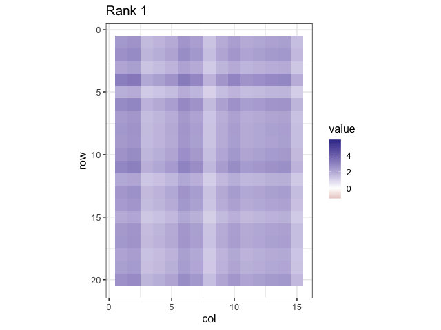

```{r opts, include = FALSE}
options(width = 90)
library(knitr)
opts_chunk$set(comment="", 
               digits = 3, 
               tidy = FALSE, 
               prompt = TRUE,
               fig.align = 'center')
require(magrittr)
require(ggplot2)
require(mlbench)
require(patchwork)
data("PimaIndiansDiabetes")
# data(Sacramento)
library(caret)
library(recipes)
library(lattice)
theme_set(theme_bw() + theme(legend.position = "top"))
```

## Recap of last lecture

-   Last week we introduced the tidyverse verbs used to manipulate (tidy) data
-   We also used the tidyverse verbs and `skimr` for exploratory data analysis and to engineer features into our datasets.

## Today's Outline

-   We'll review the R model formula approach to model specification,
-   We'll introduce data pre-processing and design/model matrix generation with the `recipes` package, and
-   We'll show how using recipes will facilitate developing feature engineering workflows that can be applied to multiple datasets (e.g. train and test as well as cross-validation[^1] datasets)

[^1]: Cross-validation is a resampling method that uses different portions of the data to test and train a model on different iterations.

## R Model Formulas

Here's a simple formula used in a linear model to predict house prices (using the dataset Sacramento from the package `modeldata`):

```{r sac}
#| echo: true
#| message: false
#| results: false
#| code-fold: true
#| code-summary: linear model to predict house prices
#| code-line-numbers: "1|2|3|4"
Sacramento <- modeldata::Sacramento
mod1 <- stats::lm(
  log(price) ~ type + sqft
  , data = Sacramento
  , subset = beds > 2
  )
```

::: {style="font-size: 60%"}
The purpose of this code chunk:

1.  subset some of the observations (using the `subset` argument)
2.  create a design matrix for 2 predictor variables (but 3 model terms)
3.  log transform the outcome variable
4.  fit a linear regression model

The first two steps create the *design-matrix* aka *model- matrix*.
:::

## Example

The Sacramento dataset has three categorical variables:

```{r}
#| echo: true
#| message: false
#| code-fold: true
#| code-line-numbers: "1|2|3|4|5"
skimr::skim(Sacramento) %>% 
  dplyr::select(c(skim_variable,contains('factor')) ) %>% 
  tidyr::drop_na() %>% 
  gt::gt() %>% 
  gtExtras:::gt_theme_espn() %>% 
  gt::tab_options( table.font.size = gt::px(20) ) %>% 
  gt::as_raw_html()
```

## Example model matrix

```{r}
#| echo: true
#| message: false
#| results: false
#| code-line-numbers: "1|2|3"
 mm <- model.matrix(
   log(price) ~ type + sqft
   , data = Sacramento
)
```

```{r}
#| echo: false
mm %>% head(14)
```

## Summary: Model Formula Method

-   Model formulas are very expressive in that they can represent model terms easily
-   The formula/terms framework does some elegant functional programming
-   Functions can be embedded inline to do fairly complex things (on single variables) and these can be applied to new data sets.

## Model formula examples

::: panel-tabset
## leave out

```{r}
#| echo: true
model.matrix(log(price) ~ -1 + type + sqft, data = Sacramento) %>% head()
```

## interaction

```{r}
#| echo: true
model.matrix(log(price) ~ type : sqft, data = Sacramento) %>% head()
```

## crossing

```{r}
#| echo: true
model.matrix(log(price) ~ type * sqft, data = Sacramento) %>% head()
```

## nesting

```{r}
#| echo: true
model.matrix(log(price) ~ type %in% sqft, data = Sacramento) %>% head()
```

## as-is

```{r}
#| echo: true
model.matrix(log(price) ~ type + sqft + I(sqft^2), data = Sacramento) %>% head()
```

contrast with log(price) \~ type + sqft + sqft\^2
:::

## Summary: Model Formula Method

There are significant limitations to what this framework can do and, in some cases, it can be very inefficient.

This is mostly due to being written well before large scale modeling and machine learning were commonplace.

## Limitations of the Current System

-   Formulas are not very extensible especially with nested or sequential operations (e.g. `y ~ scale(center(knn_impute(x)))`).
-   When used in modeling functions, you cannot recycle the previous computations.
-   For wide data sets with lots of columns, the formula method can be very inefficient and consume a significant proportion of the total execution time.

## Limitations of the Current System

-   Multivariate outcomes are kludgy by requiring `cbind` .
-   Formulas have a limited set of roles for measurements (just `predictor` and `outcome`). We'll look further at roles in the next two slides.

A more in-depth discussion of these issues can be found in [this blog post](https://rviews.rstudio.com/2017/03/01/the-r-formula-method-the-bad-parts/) (recommended to read).

## Variable Roles

Formulas have been re-implemented in different packages for a variety of different reasons:

```{r roles_1}
#| echo: true
#| message: false
#| results: false
#| eval: false
#| code-line-numbers: "3|8-10|14-16"
# ?lme4::lmer
# Subjects need to be in the data but are not part of the model
lme4::lmer(Reaction ~ Days + (Days | Subject), data = lme4::sleepstudy)

# BradleyTerry2
# We want to make the outcomes to be a function of a 
# competitor-specific function of reach 
BradleyTerry2::BTm(outcome = 1, player1 = winner, player2 = loser,
    formula = ~ reach[..] + (1|..), 
    data = boxers)

# modeltools::ModelEnvFormula (using the modeltools package for formulas)
# mob
data(PimaIndiansDiabetes, package = 'mlbench')
modeltools::ModelEnvFormula(diabetes ~ glucose | pregnant + mass +  age,
    data = PimaIndiansDiabetes)

```

## Variable Roles

A general list of possible variable roles could be:

::: {style="font-size: 75%"}
-   outcomes
-   predictors
-   stratification
-   model performance data (e.g. loan amount to compute expected loss)
-   conditioning or faceting variables (e.g. [`lattice`](https://cran.r-project.org/package=lattice) or [`ggplot2`](https://cran.r-project.org/package=ggplot2))
-   random effects or hierarchical model ID variables
-   case weights (\*)
-   offsets (\*)
-   error terms (limited to `Error` in the `aov` function)(\*)

(\*) Can be handled in formulas but are hard-coded into functions.
:::

# The Recipes package

## Recipes

In our housing price analysis we can approach the design matrix and pre-processing steps by first specifying a **sequence of steps**.

1.  `price` is an outcome
2.  `type` and `sqft` are predictors
3.  log transform `price`
4.  convert `type` to dummy variables

## Recipes

A recipe is a specification of *intent*.

One issue with the formula method is that it couples the specification for your predictors along with the model implementation.

Recipes separate the *planning* from the *doing*.

::: callout-note
The Recipes website is found at: [`https://topepo.github.io/recipes`](https://topepo.github.io/recipes)
:::

## Recipes

```{r rec_basic}
#| echo: true
#| message: false
#| code-fold: true
#| code-summary: recipes workflow
#| code-line-numbers: "2|4-6|9|11"
## Create an initial recipe with only predictors and outcome
rec <- recipes::recipe(price ~ type + sqft, data = Sacramento)

rec <- rec %>% 
  recipes::step_log(price) %>%
  recipes::step_dummy(type)

# estimate any parameters
rec_trained <- recipes::prep(rec, training = Sacramento, retain = TRUE)
# apply the computations to new_data
design_mat  <- recipes::bake(rec_trained, new_data = Sacramento)
```

Once created, a *recipe* can be `prep`ped on training data then `bake`d with any other data.

::: {style="font-size: smaller"}
-   the `prep` step calculates and stores variables required by the steps (e.g. (min,max) for scaling), using the training data
-   the `bake` step applies the steps to new data
:::

## Selecting Variables

In our recipe, we can use `dplyr`-like syntax for selecting variables, e.g. `step_dummy(type)`.

But in some cases, the names of the predictors may not be known at the time when you construct a recipe (or model formula). For example:

-   dummy variable columns
-   PCA feature extraction when you keep components that capture $\mathrm{X}\%$ of the variability.
-   discretized predictors with dynamic bins

## Example

Using the `airquality` dataset in the `datasets` package

```{r}
#| echo: true
#| message: false
#| code-line-numbers: "1|3-4|5-8"
dat <- datasets::airquality

dat %>% skimr::skim() %>% 
  dplyr::select(skim_variable:numeric.sd) %>% 
  gt::gt() %>% 
  gtExtras:::gt_theme_espn() %>% 
  gt::tab_options( table.font.size = gt::px(20) ) %>% 
  gt::as_raw_html()
```

## Example: create basic recipe[^2]

[^2]: Note that the data structure of a unprocessed recipe is a tibble

```{r}
#| echo: false
#| message: false
aq_df <- dat %>% rsample::initial_split(prop = 0.8)
aq_df_train <- aq_df %>% rsample::training()
aq_df_test <- aq_df %>% rsample::training()
```

```{r}
#| echo: true
#| message: false
#| code-line-numbers: "2|4"
# create recipe
aq_recipe <- recipes::recipe(Ozone ~ ., data = aq_df_train)

summary(aq_recipe)
```

## Example: summary of basic recipe

```{r}
#| echo: true
#| message: false
#| code-line-numbers: "2-3"
# update roles for variables with missing data
aq_recipe <- aq_recipe %>% 
  recipes::update_role(Ozone, Solar.R, new_role = 'NA_Variable')

summary(aq_recipe)
```

## Example: add recipe steps[^3]

[^3]: Note the use of dplyr-like variable selectors in the recipe

```{r}
#| echo: true
#| message: false
#| code-line-numbers: "1|2-3|4-5|6-7|8-9"
aq_recipe <- aq_recipe %>% 
  # impute Ozone missing values using the mean
  step_impute_mean(has_role('NA_Variable'), -Solar.R) %>%
  # impute Solar.R missing values using knn
  step_impute_knn(contains('.R'), neighbors = 3) %>%
  # center all variable except the NA_Variable
  step_center(all_numeric(), -has_role('NA_Variable')) %>%
  # scale all variable except the NA_Variable
  step_scale(all_numeric(), -has_role('NA_Variable'))
```

## Example: recipe prep and bake

```{r}
#| echo: true
#| message: false
#| code-line-numbers: "1-2|4-5"
# prep with training data
aq_prep_train <- aq_recipe %>% prep(aq_df_train)

# bake with testing data
aq_bake <- aq_prep_train %>% bake(aq_df_test)
```

## Example: recipe prep values[^4]

[^4]: Note the data structure of a prepped recipe: a tibble, but with different data than the unprocessed recipe

The prepped recipe is a data structure that contains any computed values.

```{r}
#| echo: true
aq_prep_train |> recipes::tidy()
```

## Example: recipe prep values

We can examine any computed values by using the step number as an argument to `recipes::tidy`.

```{r}
#| echo: true
aq_prep_train |> recipes::tidy(3)
```

## Example: change roles again

Here we update the original recipe to set the required roles.

```{r}
#| echo: true
#| message: false
#| code-line-numbers: "1-2|4-5"
aq_recipe <- aq_recipe %>% 
  recipes::update_role(Ozone, new_role = 'outcome') %>% 
  recipes::update_role(Solar.R, new_role = 'predictor')
```

## Recommended Baseline Steps

Baseline preprocessing methods can be categorized as:

::: {style="font-size: x-large"}
-   **dummy**: Do qualitative predictors require a numeric encoding (e.g., via dummy variables or other methods)?
-   **zv**: Should columns with a single unique value be removed?
-   **impute**: If some predictors are missing, should they be estimated via imputation?
-   **decorrelate**: If there are correlated predictors, should this correlation be mitigated? This might mean filtering out predictors, using principal component analysis, or a model-based technique (e.g., regularization).
-   **normalize**: Should predictors be centered and scaled?
-   **transform**: Is it helpful to transform predictors to be more symmetric?

See [recommended preprocessing](https://www.tmwr.org/pre-proc-table) for recipe steps.
:::

## Available Steps

-   **Basic**: [logs](https://recipes.tidymodels.org/reference/step_log.html), [roots](https://recipes.tidymodels.org/reference/step_sqrt.html), [polynomials](https://recipes.tidymodels.org/reference/step_poly.html), [logits](https://recipes.tidymodels.org/reference/step_logit.html), [hyperbolics](https://recipes.tidymodels.org/reference/step_hyperbolic.html)
-   **Encodings**: [dummy variables](https://recipes.tidymodels.org/reference/step_dummy.html), ["other"](https://recipes.tidymodels.org/reference/step_other.html) factor level collapsing, [discretization](https://recipes.tidymodels.org/reference/discretize.html)
-   **Date Features**: Encodings for [day/doy/month](https://recipes.tidymodels.org/reference/step_date.html) etc, [holiday indicators](https://recipes.tidymodels.org/reference/step_holiday.html)
-   **Filters**: [correlation](https://recipes.tidymodels.org/reference/step_corr.html), [near-zero variables](https://recipes.tidymodels.org/reference/step_nzv.html), [linear dependencies](https://recipes.tidymodels.org/reference/step_lincomb.html)
-   **Imputation**: [*K*-nearest neighbors](https://recipes.tidymodels.org/reference/step_knnimpute.html), [bagged trees](https://recipes.tidymodels.org/reference/step_bagimpute.html), [mean](https://recipes.tidymodels.org/reference/step_meanimpute.html)/[mode](https://recipes.tidymodels.org/reference/step_modeimpute.html) imputation

## Available Steps

-   **Normalization/Transformations**: [center](https://recipes.tidymodels.org/reference/step_center.html), [scale](https://recipes.tidymodels.org/reference/step_scale.html), [range](https://recipes.tidymodels.org/reference/step_range.html), [Box-Cox](https://recipes.tidymodels.org/reference/step_BoxCox.html), [Yeo-Johnson](https://recipes.tidymodels.org/reference/step_YeoJohnson.html)
-   **Dimension Reduction**: [PCA](https://recipes.tidymodels.org/reference/step_pca.html), [kernel PCA](https://recipes.tidymodels.org/reference/step_kpca.html), [ICA](https://recipes.tidymodels.org/reference/step_ica.html), [Isomap](https://recipes.tidymodels.org/reference/step_isomap.html), [data depth](https://recipes.tidymodels.org/reference/step_depth.html) features, [class distances](https://recipes.tidymodels.org/reference/step_classdist.html)
-   **Others**: [spline basis functions](https://recipes.tidymodels.org/reference/step_ns.html), [interactions](https://recipes.tidymodels.org/reference/step_interact.html), [spatial sign](https://recipes.tidymodels.org/reference/step_spatialsign.html)

More on the way (i.e. autoencoders, more imputation methods, etc.)

One of the [package vignettes](https://www.tidymodels.org/learn/develop/recipes/) shows how to write your own step functions.

## Extending

Need to add more pre-processing or other operations?

```{r rec_add}
#| echo: true
#| message: false
#| results: false
standardized <- rec_trained %>%
  recipes::step_center(recipes::all_numeric()) %>%
  recipes::step_scale(recipes::all_numeric()) %>%
  recipes::step_pca(recipes::all_numeric())
          
## Only estimate the new parts:
standardized <- recipes::prep(standardized)
```

If an initial step is computationally expensive, you don't have to redo those operations to add more.

## Extending

Recipes can also be created with different roles manually (note: no formula)

```{r rec_man, eval = FALSE}
#| echo: true
#| message: false
#| code-line-numbers: "2|3|4|5"
rec <- 
  recipes::recipe(data = Sacramento) %>%
  recipes::update_role(price, new_role = "outcome") %>%
  recipes::update_role(type, sqft, new_role = "predictor") %>%
  recipes::update_role(zip, new_role = "strata")
```

Also, the sequential nature of steps means that steps don't have to be R operations and could call other compute engines (e.g. Weka, scikit-learn, Tensorflow, etc. )

## Extending

We can create wrappers to work with recipes too:

```{r lm}
#| echo: true
#| message: false
#| code-line-numbers: "2|3-6"
lin_reg.recipe <- function(rec, data, ...) {
  trained <- recipes::prep(rec, training = data)
  lm.fit(
    x = recipes::bake(trained, newdata = data, all_predictors())
    , y = recipes::bake(trained, newdata = data, all_outcomes())
    , ...
  )
}
```

## An Example

[Kuhn and Johnson](http://appliedpredictivemodeling.com) (2013) analyze a data set where thousands of cells are determined to be well-segmented (WS) or poorly segmented (PS) based on 58 image features. We would like to make predictions of the segmentation quality based on these features.

::: {.callout-note style="font-size: smaller"}
The dataset `segmentationData` is in the package `caret` and represents the results of automated microscopy to collect images of cultured cells. The images are subjected to segmentation algorithms to identify cellular structures and quantitate their morphology, for hundreds to millions of individual cells. A column named ***Case*** identifies *Train* and *Test* observations.
:::

## An Example

The `segmentationData` dataset has 61 columns

```{r image_load}
#| echo: true
#| message: false
#| code-line-numbers: "1|3-5|7-9"
data(segmentationData, package = "caret")

seg_train <- segmentationData %>% 
  dplyr::filter(Case == "Train") %>% 
  dplyr::select(-Case)

seg_test  <- segmentationData %>% 
  dplyr::filter(Case == "Test")  %>% 
  dplyr::select(-Case)
```

## A Simple Recipe

```{r image_rec}
#| echo: true
#| message: false
#| code-fold: true
#| code-line-numbers: "1|3-7|8-10|12-19"
rec <- recipes::recipe(Class  ~ ., data = seg_train)

basic <- rec %>%
  # the column Cell contains identifiers
  recipes::update_role(Cell, new_role = 'ID') %>%
  # Correct some predictors for skewness
  recipes::step_YeoJohnson(recipes::all_predictors()) %>%
  # Standardize the values
  recipes::step_center(recipes::all_predictors()) %>%
  recipes::step_scale(recipes::all_predictors())

# Estimate the transformation and standardization parameters 
basic <- 
  recipes::prep(
    basic
    , training = seg_train
    , verbose = FALSE
    , retain = TRUE
  )  
```

::: {.callout-note style="font-size: smaller"}
The Yeo-Johnson is similar to the Box-Cox method, however it allows for the transformation of nonpositive data as well. A Box Cox transformation is a transformation of non-normal dependent variables into a normal shape. Both transformations have a single parameter $\lambda$.
:::

## A Simple Recipe

We can examine the center, scale, and Yeo Johnson parameters computed for each continuous measurement.

::: panel-tabset
## Yeo Johnson

```{r}
#| echo: true
basic |> recipes::tidy(1) |> dplyr::slice_head(n=8)
```

## means

```{r}
#| echo: true
basic |> recipes::tidy(2) |> dplyr::slice_head(n=8)
```

## std deviations

```{r}
#| echo: true
basic |> recipes::tidy(3) |> dplyr::slice_head(n=8)
```
:::

## More sophisticated steps: PCA

Principal Component Analysis (PCA) is a technique used in data analysis to simplify a large dataset (many measurements/columns) by reducing its number of dimensions (columns) while still retaining as much important information as possible.

A pretty good description of PCA can be found [here](https://towardsdatascience.com/feature-transformations-a-tutorial-on-pca-and-lda-1ac160088092/).

## More sophisticated steps: PCA

PCA step-by-step:

::: {style="font-size: large"}
1.  **Standardize the Data**:
    -   Before applying PCA, we often standardize the data, which means adjusting all variables to have the same scale. This is important because PCA is sensitive to the scale of the data.
2.  **Find the Principal Components**:
    -   PCA identifies the directions (principal components) in which the data varies the most. Think of these as new axes in a new coordinate system that best capture the variation in the data.
    -   The first principal component captures the most variation. The second principal component is orthogonal (at a right angle) to the first and captures the next most variation, and so on.
3.  **Transform the Data**:
    -   We then transform the original data into this new set of principal components. Each data point can now be represented in terms of these principal components rather than the original variables.
:::

## More sophisticated steps: PCA

::: {style="font-size: large"}
You have test scores in Math, Science, and English. You want to find a way to understand overall performance without looking at all three subjects separately.

1.  **Original Data**: You have three scores for each student: Math, Science, and English.

2.  **Standardize the Data**: You adjust the scores so that Math, Science, and English scores are on the same scale.

3.  **Find Principal Components**:

    -   PCA finds that the first principal component might be a combination of Math and Science scores, capturing the overall academic ability in quantitative subjects.
    -   The second principal component might represent the difference between scores in English and the average of Math and Science scores, capturing a different aspect of performance.

4.  **Transform the Data**:

    -   Each student’s performance can now be described using these new principal components instead of the original scores. For example, a student might have a high score on the first principal component (strong in Math and Science) but a lower score on the second (relatively weaker in English).
:::

## More sophisticated steps: PCA

::: {style="font-size: 75%"}
**Benefits of PCA**

-   **Simplification**: Reduces the number of variables, making it easier to analyze and visualize the data.
-   **Noise Reduction**: Helps to remove noise from the data by focusing on the main components that capture the most variation.
-   **Feature Extraction**: Identifies the most important variables (principal components) that explain the majority of the variance in the data.

PCA is like finding the most important "directions" in your data, where most of the interesting stuff happens. It helps you see the big picture by reducing complexity while keeping the essential information. This makes it a powerful tool for data analysis, especially when dealing with high-dimensional datasets.
:::

## Principal Component Analysis

```{r image_pca}
#| echo: true
#| message: false
#| code-fold: true
#| code-line-numbers: "1|2|3-4"
pca <- basic %>% 
  recipes::step_pca(
    recipes::all_predictors()
    , num_comp = 5
  )
```

```{r}
#| echo: false
summary(pca)
```

## Principal Component Analysis

```{r image_pca_train}
#| echo: true
#| message: false
pca %<>% recipes::prep() 
```

::: panel-tabset
## summary

```{r}
#| echo: true
pca %>% summary()
```

## components

```{r}
#| echo: true
pca %>% recipes::tidy(4)
```
:::

## Principal Component Analysis

```{r}
#| echo: true
#| message: false
#| code-line-numbers: "2|3|4"
pca %<>% 
  recipes::bake(
    new_data = seg_test
    , everything()
  )
pca[1:8, 1:7]
```

## Principal Component Analysis

```{r image_pca_plot}
#| echo: true
#| message: false
#| code-fold: true
#| code-summary: "PCs are predictive"
#| width: "80%"
pca %>% ggplot(aes(x = PC1, y = PC2, color = Class)) + 
  geom_point(alpha = .4) +
  theme_bw(base_size = 25)
```


## Business Problem with PCA

:::::: columns
:::: {.column width="35%"}
::: {style="font-size: xx-large"}
-   Firms collect large customer by product purchase data
-   Data is high dimensional and noisy
-   We want simpler views to see patterns and predict behavior
:::
::::

::: {.column width="65%"}
```{r}
#| echo: false
#| label: business PCA data

set.seed(123)

# Example customer-product purchase matrix
customers <- paste0("C", 1:20)
products  <- paste0("P", 1:15)
M <- matrix(rpois(300, lambda = 2), nrow = 20, dimnames = list(customers, products))

hm <- function(M, title_txt) {
  tibble::as_tibble(M) |>
    dplyr::mutate(customer = row_number()) |>
    tidyr::pivot_longer(-customer, names_to = "product", values_to = "val") |>
    dplyr::mutate(product = as.integer(factor(product))) |>
    ggplot(aes(product, customer, fill = val)) +
    geom_tile() +
    scale_fill_gradient(low = "white", high = "darkblue") +
    scale_y_reverse() +
    coord_fixed() +
    labs(title = title_txt, x = "Product", y = "Customer", fill = "Purchases") +
    theme_bw(base_size = 16)
}
```

```{r}
#| eval: true
#| label: business PCA data plot
#| fig-width: 6     
#| fig-align: center
hm(M, "Customer Product Purchases 20x15")
```
:::
::::::

## SVD as Compression

-   SVD factors the matrix $M = U\Sigma V^\top$
-   $U,V$ have orthogonal columns, and $\Sigma$ is a diagonal matrix of singular values
    -   Keep the top k singular values for a rank $k$ summary
-   Interpretation:
    -   $U\Sigma$ gives customer preferences in reduced dimensions
    -   $V$ gives product features in reduced dimensions

## Low Rank Approximation

```{r}
#| echo: true
#| label: SVD low rank
#| code-fold: true
#| code-summary: approximations at rank 2 and 5
#| fig-width: 10     
#| fig-align: center
sv <- svd(M)
Mk <- function(k) sv$u[,1:k, drop = FALSE] %*% diag(sv$d[1:k], k) %*% t(sv$v[,1:k, drop = FALSE])

p1 <- hm(Mk(2), "Rank 2 Approximation")
p2 <- hm(Mk(5), "Rank 5 Approximation")
p1 + p2
```

## Low Rank Approximations

:::::: columns
::: {.column width="60%"}
```{r}
#| eval: false
#| message: false
#| echo: false
# optional animation with gganimate
library(gganimate)
frames <- purrr::map_dfr(1:10, \(k) {
  tibble::as_tibble(Mk(k)) |>
    dplyr::mutate(r = row_number(), k = k) |>
    tidyr::pivot_longer(-c(r,k), names_to = "c", values_to = "val") |>
    dplyr::mutate(c = as.integer(gsub("V","", c)))
})
g <- ggplot(frames, aes(c, r, fill = val)) +
  geom_tile() +
  scale_y_reverse() +
  scale_fill_gradient2() +
  coord_fixed() +
  labs(title = "Rank {closest_state}", x = "col", y = "row", fill = "value") +
  transition_states(k, transition_length = 1, state_length = 1) + theme_bw(base_size = 16)
anim_save("images/small_bizsvd-rank-growth.gif", animate(g, nframes = 100, fps = 10, width = 640, height = 480))
```

```{r}
#| label: SVD low rank animation
#| echo: false
#| fig-width: 10     
#| fig-align: center


```
:::

:::: {.column width="40%"}
::: {style="font-size: x-large"}
```{r}
#| echo: true
#| code-fold: true
#| code-summary: plot of cumulative variance explained
#| label: plot of cumulative variance 
#| fig-height: 10
#| fig-width: 8
#| fig-align: center
var_expl <- sv$d^2 / sum(sv$d^2)
tibble::tibble(k = 1:length(var_expl), share = cumsum(var_expl)) |>
  ggplot(aes(k, share)) +
  geom_line() + geom_point() +
  scale_y_continuous(labels = scales::percent) +
  labs(title = "Cumulative Variance Explained", x = "Rank k", y = "Variance") +   
  theme_bw(base_size = 24)
```
:::
::::
::::::

## PCA in Practice

::::: columns
::: {.column width="50%"}
```{r}
#| echo: false
#| message: false
library(tidyverse)
library(ggplot2)
set.seed(42)

# Simulate a 1000 x 100 customer by product matrix with latent structure
n_cust <- 1000
n_prod <- 100

k_true <- 5
U_true <- matrix(rnorm(n_cust * k_true), n_cust, k_true)
V_true <- matrix(rnorm(n_prod * k_true),  n_prod,  k_true)
svals  <- seq(5, 1, length.out = k_true)  # strengths of latent factors

Signal <- U_true %*% diag(svals, k_true) %*% t(V_true)
Noise  <- matrix(rnorm(n_cust * n_prod, sd = 0.8), n_cust, n_prod)
M      <- Signal + Noise

# Center columns to focus on structure across products
X <- scale(M, center = TRUE, scale = FALSE)

# SVD
sv <- svd(X)
var_expl <- sv$d^2
cum_share <- cumsum(var_expl) / sum(var_expl)

# Prepare data for plot
df <- tibble::tibble(rank_k = seq_along(cum_share), cum_variance = cum_share)
```

```{r}
#| echo: false
#| fig-width: 8
#| fig-height: 9    
#| fig-align: center
#| label: Cumulative variance by rank 1000 customers
ggplot(df, aes(rank_k, cum_variance)) +
  geom_line() +
  geom_point() +
  scale_y_continuous(labels = scales::percent_format(accuracy = 1)) +
  labs(title = "Cumulative variance explained", x = "Rank k", y = "Share") +   
  theme_bw(base_size = 24)
```
:::

::: {.column width="50%"}
```{r}
#| echo: false
#| fig-width: 8
#| fig-height: 9      
#| fig-align: center
#| label: Top Singular Values
# Show the first 15 singular values for a quick check
tibble(k = 1:15, d = sv$d[1:15]) |>
  ggplot(aes(k, d)) +
  geom_col() +
  labs(title = "Top singular values", x = "Rank k", y = "Singular value") +   
  theme_bw(base_size = 24)
```
:::
:::::


## Recap

-   We've used the `recipes` package to create a workflow for data pre-processing and feature engineering
-   The `recipe` verbs define the pre-processing and feature engineering steps
-   using the recipe object, the verb `prep` prepares the data on a training set, storing the meta-parameters.
-   the verb `bake` applies the prepped recipe to new data, using the meta-parameters.

## Recap

-   When first created, the recipe object contains the the steps defined for pre-processing
-   Once the recipe has been prepped, usually on training data, it contains the calculations required to perform pre-processing of data in the context of the training set, e.g. mean and stdev of normalized columns, PCA components, etc. ( the meta-parameters).
-   the prepped recipe is used to preprocess datasets in context of the training data. E.g. to normalize a column in the test data we subtract the corresponding training set mean and divide by the corresponding training set stdev.
