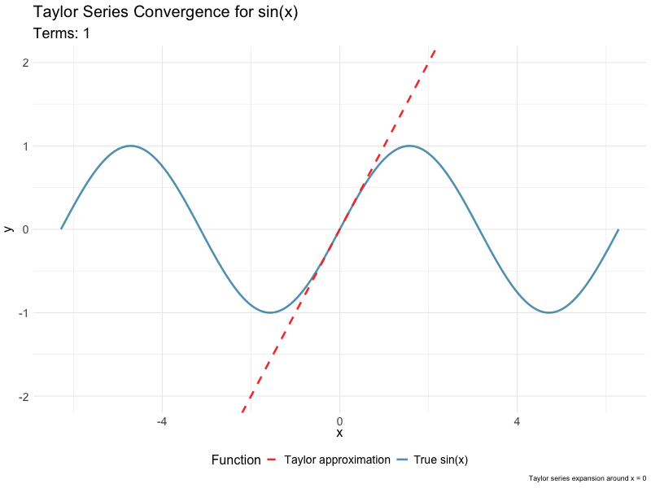
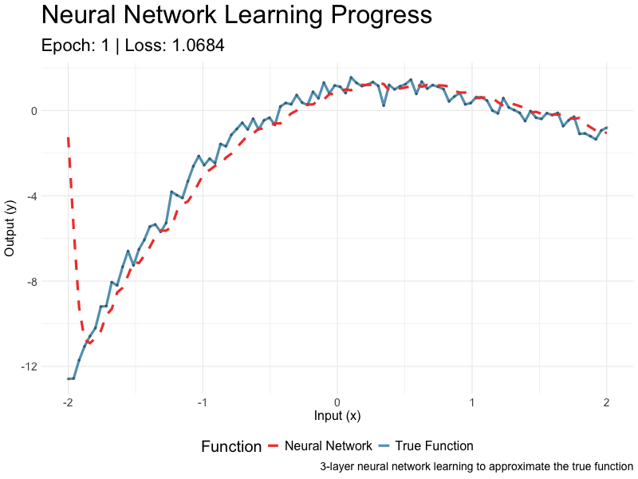
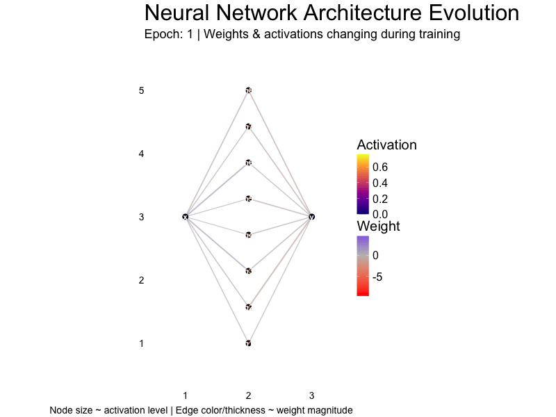

```{r opts, include = FALSE}
options(width = 90)
library(knitr)
opts_chunk$set(comment="", 
               digits = 3, 
               tidy = FALSE, 
               prompt = TRUE,
               fig.align = 'center')
require(magrittr)
require(ggplot2)
theme_set(theme_bw(base_size = 18) + theme(legend.position = "top"))
```

## Recap of last lecture

-   Last time we worked with the `recipes` package to develop workflows for pre-processing our data.

-   Today we look at regression methods we might apply to understand relationships between measurements in our data.

# Linear regression

## Linear regression models

In the simple linear regression (SLR) model, we have $N$ observations of a single outcome variable $Y$ along with $D$ predictor (aka co-variate) variables $\mathbf{x}$ where the likelihood[^1] of observing $Y=y$ is conditional on the predictor values $x$ and parameters $\theta=\{\beta,\sigma^2\}$:

[^1]: In SLR models we assume a Normal (Gaussian) probability model for the data generation process. For non-Normal data generation processes we use generalized linear models, which we'll discuss later.

$$
\pi\left(Y=y|\mathbf{x,\theta}\right)=\mathscr{N}\left(\left.y\right|\mu(\mathbf{x};\beta),\sigma^{2}\right)
$$

## Linear regression models

In the SLR model, $\mathscr{N}\left(\left.y\right|\mu(\mathbf{x};\beta),\sigma^{2}\right)$ is a Normal probability density with mean $\mu(\mathbf{x};\beta)$ and variance $\sigma^2$, where $\sigma^2$ is a constant and the mean is a function of the predictors $\mathbf{x}$ and a vector of parameters $\beta$.

The mean function $\mu(\mathbf{x};\beta)$ is often assumed to be continuous, i.e. a small change in the predictors implies a small change in the outcome. And in this case it is possible to decompose the mean function into a sum of simpler functions, e.g. polynomial functions (like straight lines, parabolas, and more).

## Taylor Series

The decomposition of a continuous function $f$ of a single variable $x$ into a sum of simpler polynomial functions is called a **Taylor series** and is defined as follows:

::: {style="font-size: x-large"}
$$
f(x;x_0)=\sum_{n=0}\beta_n(x-x_0)^n=\beta_0+\beta_1(x-x_0)+\beta_2(x-x_0)^2+\beta_3(x-x_0)^3+\ldots
$$
:::

where $\frac{d^nf(x)}{dx^n}|_{x=x_0} \equiv f^{(n)}(x_0) = n!\beta_n\;\rightarrow \beta_n=\frac{1}{n!}f^{(n)}(x_0)$

## Taylor Series

::: {style="font-size: x-large"}
$$
f(x;x_0)=\sum_n\beta_n(x-x_0)^n=\beta_0+\beta_1(x-x_0)+\beta_2(x-x_0)^2+\beta_3(x-x_0)^3+\ldots
$$
:::

We can use the following constructive proof to find the coefficients in the series:

::: {style="font-size: x-large"}
1.  $0^{th}$ derivative at $x=x_0$: $f(x_0) = \beta_0$
2.  $1^{st}$ derivative at $x=x_0$: $f'(x_0) = \beta_1$
3.  $2^{nd}$ derivative at $x=x_0$: $f''(x_0) = 2\beta_2$
4.  $3^{rd}$ derivative at $x=x_0$: $f'''(x_0) = 6\beta_3$
5.  $n^{th}$ derivative at $x=x_0$: $f^{(n)}(x_0) = n!\beta_n$
:::

## Linear regression models

Similarly, when the number of variables is $D=2$ the Taylor series is (writing $f_{x}\equiv\frac{\partial f}{\partial x}$, $f_{y}\equiv\frac{\partial f}{\partial y}$, $f_{x,y}\equiv\frac{\partial^2 f}{\partial x,\partial y}$ and so on):

::: {style="font-size: x-large"}
$$
\begin{align*}
f(x,y;x_0,y_0) & =f(x_{0},y_{0})+f_{x}(x_{0},y_{0})(x-x_{0})+f_{y}(x_{0},y_{0})(y-y_{0})\\
 & = + \frac{1}{2}f_{x,x}(x_{0},y_{0})(x-x_{0})^{2}+\frac{1}{2}f_{y,y}(x_{0},y_{0})(y-y_{0})^{2}\\
 & = + \frac{1}{2}f_{x,y}(x_{0},y_{0})(x-x_{0})(y-y_{0})+\ldots
\end{align*}
$$

which decomposes a function of two variables into a sum of simpler functions, e.g. polynomial functions (like 2-D straight lines, parabolas, and more).
:::

## Taylor Series Example (1D)

{fig-align="center"}

## Taylor Series Example

```{r}
#| echo: false
# Define the domain
x <- seq(-2*pi, 2*pi, length.out = 1000)

# Function to calculate Taylor series for sin(x) around x = 0
taylor_sin <- function(x, n_terms) {
  result <- rep(0, length(x))
  
  for (n in 0:(n_terms-1)) {
    term <- ((-1)^n) * (x^(2*n + 1)) / factorial(2*n + 1)
    result <- result + term
  }
  
  return(result)
}

# Create data for animation
max_terms <- 10
animation_data <- tibble::tibble()

for (n in 1:max_terms) {
  current_data <- tibble::tibble(
    x = x,
    true_sin = sin(x),
    taylor_approx = taylor_sin(x, n),
    n_terms = n,
    term_label = paste("n =", n, "terms")
  )
  
  animation_data <- dplyr::bind_rows(animation_data, current_data)
}

error_data <- animation_data %>%
  dplyr::mutate(
    absolute_error = abs(true_sin - taylor_approx),
    relative_error = ifelse(true_sin != 0, absolute_error / abs(true_sin), 0)
  ) %>%
  dplyr::group_by(n_terms) %>%
  dplyr::summarise(
    max_absolute_error = max(absolute_error),
    mean_absolute_error = mean(absolute_error),
    .groups = "drop"
  )

# Plot error convergence
error_data %>%
  ggplot(aes(x = n_terms)) +
  geom_line(aes(y = max_absolute_error, color = "Maximum Error"), 
            size = 1.2) +
  geom_line(aes(y = mean_absolute_error, color = "Mean Error"), 
            size = 1.2) +
  geom_point(aes(y = max_absolute_error, color = "Maximum Error"), 
             size = 3) +
  geom_point(aes(y = mean_absolute_error, color = "Mean Error"), 
             size = 3) +
  scale_color_manual(values = c("Maximum Error" = "#F24236", 
                                "Mean Error" = "#2E86AB")) +
  scale_y_log10() +
  scale_x_continuous(breaks = pretty(error_data$n_terms, n = 10)) +
  labs(
    title = "Taylor Series Approximation Error",
    subtitle = "Error decreases as more terms are added",
    x = "Number of Terms",
    y = "Absolute Error (log scale)",
    color = "Error Type"
  ) +
  theme_minimal() +
  theme(
    plot.title = element_text(size = 16, face = "bold"),
    plot.subtitle = element_text(size = 14),
    legend.position = "bottom"
  )
```

## Taylor Series Example

Taylor series for $\sin(x)$ around $x = 0$:

$$
\begin{align*}
\sin(x) & =x-\frac{x^{3}}{3!}+\frac{x^{5}}{5!}-\frac{x^{7}}{7!}+\frac{x^{9}}{9!}+\ldots\\
 & =x-\frac{x^{3}}{6}+\frac{x^{5}}{120}-\frac{x^{7}}{5040}+\frac{x^{9}}{362880}+\ldots
\end{align*}
$$

## Linear regression models

For one co-variate, if the mean function is smooth (i.e. not changing rapidly with the co-variate) then $\mu^{(n)}$ will be decreasing in $n$, and furthermore $\beta_n$ decreases as $1/n!$, so SLR models in one co-variate typically use only the first two or at most three $\beta$ coefficients.

In this case the likelihood of observing $Y=y$ is conditional on the predictor values $x$ and parameters $\theta=\{\beta_0,\beta_1,\sigma^2\}$:

$\theta=\{\beta_{0},\mathbf{\beta_1},\sigma^{2}\}$ are the *parameters* of the model, where $\beta_0$ is a constant and $\beta_1$ is the co-variate *weight* or *regression* coefficient.

## Linear regression models

For multiple co-variates, If the mean function is smooth (i.e. not changing rapidly with the co-variates) then under similar (reasonable) assumptions on the differentials, it is common to see SLR models using only the first order coefficients, i.e. a constant and one coefficient for each co-variate.

## Linear regression models

::: callout-note
When $D>1$ it is common to append the unit vector to the covariate matrix $X=(1,x_1,x_2,\ldots)$ so that the coefficient vector is $\mathbf{\beta}=(\beta_0,\beta_{x_1},\beta_{x_2},\ldots)$, and the model can be expressed[^2] as a vector equation: $y=\mathbf{x}\cdot \mathbf{\beta}$.
:::

[^2]: In the 1D case, the constant is often explicit and the RHS of the regression equation is written as $1+\beta\mathbf{x}$, which estimates two coefficients $\beta_0, \beta_1$.

## Linear regression models

Recall that the one dimensional Normal/Gaussian probability density (aka likelihood) for outcome $y_n$ and mean $\beta x_n$ is:

$$
\pi\left(y_n;\mu=\beta x_n,\sigma^2\right)=\mathscr{N}\left(y_n;\mu=\beta x_n,\sigma^2\right)=\frac{1}{\sqrt{2\pi\sigma^2}}e^{\frac{1}{2}\frac{(y_n-\beta x_n)^2}{\sigma^2}}
$$

And the likelihood of multiple observations is the product of the likelihoods for each observation.

## Linear regression models

To fit the 1D linear regression model given $N$ data samples, we [**minimize**]{.underline} the negative log-likelihood (NLL) on the training set.

::: {style="font-size: x-large"}
$$
\begin{align*}
\text{NLL}\left(\beta,\sigma^{2}\right) & =-\sum_{n=1}^{N}\log\left[\left(\frac{1}{2\pi\sigma^{2}}\right)^{\frac{1}{2}}\exp\left(-\frac{1}{2\sigma^{2}}\left(y_{n}-\beta x_{n}\right)^{2}\right)\right]\\
 & =\frac{1}{2\sigma^{2}}\sum_{n=1}^{N}\left(y_{n}-\hat{y}_{n}\right)^{2}-\frac{N}{2}\log\left(2\pi\sigma^{2}\right)
\end{align*}
$$
:::

where the predicted response is $\hat{y}\equiv\beta x_{n}$. This is also the maximum likelihood estimation (MLE) method.

## Linear regression models

Minimizing the NLL by minimizing the residual sum of squares ($\text{RSS}=\sum_{n=1}^{N}\left(y_{n}-\hat{y}_{n}\right)^{2}$) is the same as minimizing

-   the **mean squared error** $\text{MSE}\left(\beta\right) = \frac{1}{N}\text{RSS}\left(\beta\right)$
-   the **root mean squared error** $\text{RMSE}\left(\beta\right) = \sqrt{\text{MSE}\left(\beta\right)}$

## Aside: empirical risk minimization

The MLE can be generalized by replacing the NLL ($\ell\left(y_{n},\theta;x_{n}\right)=-\log\pi\left(y_n|x_n,\theta\right)$) with any other loss function to get

$$
\mathscr{L}\left(\theta\right)=\frac{1}{N}\sum_{n=1}^{N}\ell\left(y_{n},\theta;x_{n}\right)
$$

This is known as the empirical risk minimization (ERM) - the expected loss taken with respect to the empirical distribution. We'll see other loss functions later when discussing [**ridge**]{.underline}, [**lasso**]{.underline}, and [**elastic net**]{.underline} regression.

## Linear regression models?

Focusing on just the coefficients $\beta$, the minimum NLL is (up to a constant) the minimum of the residual sum of squares (RSS)[^3] with coefficient estimates $\hat\beta$ :

[^3]: i.e. minimizing the squared prediction error, aka ordinary least squares.

$$ 
\begin{align*}\text{RSS}\left(\beta\right) & =\frac{1}{2}\sum_{n=1}^{N}\left(y_{n}-\beta'x_{n}\right)^{2}=\frac{1}{2}\left\Vert y_{n}-\beta'x_{n}\right\Vert ^{2}\\
 & =\frac{1}{2}\left(y_{n}-\beta'x_{n}\right)'\left(y_{n}-\beta'x_{n}\right)\\
\\
\end{align*}
$$

## Linear regression models

#### Ordinary least squares (OLS)

Note that, given the assumption that the data generation process is Normal/Gaussian, we can write our regression equation in terms of individual observations as

$$
y_i=\beta_0+\beta_1 x_i + u_i
$$

where the error term $u_i$ is a sample from $\mathscr{N}\left(0,\sigma^{2}\right)$ which in turn implies $\mathbb{E}\left[u\right]=0;\;\mathbb{E}\left[\left.u\right|x\right]=0$

The independence of the covariates and the errors/residuals is a [**testable assumption**]{.underline}.

## Linear regression models

#### Ordinary least squares (OLS)

It follows from the zero mean of the errors ($\mathbb{E}\left[u\right]=0$) independence of the covariates and the errors ($\mathbb{E}\left[\left.u\right|x\right]=0$) that

$$
\begin{align*}
\mathbb{E}\left[y-\beta_{0}-\beta_{1}x\right] & =0\\
\mathbb{E}\left[x\left(y-\beta_{0}-\beta_{1}x\right)\right] & =0
\end{align*}
$$

## Linear regression models

#### Ordinary least squares (OLS)

Writing these equations in terms of our samples (where $\hat{\beta}_{0}, \hat{\beta}_{1}$ are our coefficient estimates)

$$
\begin{align*}
\frac{1}{N}\sum_{i-1}^{N}y_{i}-\hat{\beta}_{0}-\hat{\beta}_{1}x_{i} & =0\\
\frac{1}{N}\sum_{i-1}^{N}x_{i}\left(y_{i}-\hat{\beta}_{0}-\hat{\beta}_{1}x_{i}\right) & =0
\end{align*}
$$

## Linear regression models

#### Ordinary least squares (OLS)

From the first equation we get a new equation that relates the means of outcome and predictors:

$$
\begin{align*}
\bar{y}-\hat{\beta}_{0}-\hat{\beta}_{1}\bar{x} & =0\\
\bar{y}-\hat{\beta}_{1}\bar{x} & =\hat{\beta}_{0}
\end{align*}
$$

## Linear regression models

#### Ordinary least squares (OLS)

Substituting for $\hat{\beta}_{0}$ in the independence equation[^4]

[^4]:
    ::: {style="font-size: x-small"}
    The last equation comes from subtracting zero to both sides of the second equation, e.g. $\frac{1}{N}\sum_{i-1}^{N}\bar{x}\left(y_{i}-\bar{y}\right)=0=\frac{1}{N}\sum_{i-1}^{N}\bar{x}\left(x_{i}-\bar{x}\right)$
    :::

::: {style="font-size: x-large"}
$$
\begin{align*}
\frac{1}{N}\sum_{i-1}^{N}x_{i}\left(y_{i}-\left(\bar{y}-\hat{\beta}_{1}\bar{x}\right)-\hat{\beta}_{1}x_{i}\right) & =0\\
\frac{1}{N}\sum_{i-1}^{N}x_{i}\left(y_{i}-\bar{y}\right) & =\hat{\beta}_{1}\frac{1}{N}\sum_{i-1}^{N}x_{i}\left(x_{i}-\bar{x}\right)\\
\frac{1}{N}\sum_{i-1}^{N}\left(x_{i}-\bar{x}\right)\left(y_{i}-\bar{y}\right) & =\hat{\beta}_{1}\frac{1}{N}\sum_{i-1}^{N}\left(x_{i}-\bar{x}\right)^2
\end{align*}
$$
:::

## Linear regression models

#### Ordinary least squares (OLS)[^5]

[^5]: extremely useful equation, since it relates the statistics of our variables to the coefficient estimate.

So as long as $\sum_{i-1}^{N}\left(\bar{x}-x_{i}\right)^2\ne 0$

$$
\begin{align*}
\hat{\beta}_{1} & =\frac{\sum_{i-1}^{N}\left(x_{i}-\bar{x}\right)\left(y_{i}-\bar{y}\right)}{\sum_{i-1}^{N}\left(\bar{x}_{i}-x_{i}\right)^2}\\
 & =\frac{\text{sample covariance}(x_{i}y_{i})}{\text{sample variance}(x_{i})}
\end{align*}
$$

## Linear regression models

Similarly, in the matrix (multivariate regression) equation, the minimum of the RSS is solved by (assuming $N>D$):

$$
\hat{\mathbf{\beta}}_{OLS}=\left(X'X\right)^{-1}\left(X'Y\right) = \frac{\text{cov}(X,Y)}{\text{var}(X)}
$$

There are algorithmic issues with computing $\left(X'X\right)^{-1}$ though, so we could instead write $X\beta=y$ and try to solve $\hat{\mathbf{\beta}}_{OLS}=X^{-1}y$ .

## Linear regression models

Now we compute the variance of our estimate as follows:

$$
\begin{align*}
\hat{\mathbf{\beta}}_{OLS} & =\left(X'X\right)^{-1}\left(X'Y\right);\,Y=X\beta+\epsilon\\
 & =\left(X'X\right)^{-1}\left(X'X\beta+X'\epsilon\right)\\
 & =\beta+\left(X'X\right)^{-1}X'\epsilon\\
\text{var}\left(\hat{\mathbf{\beta}}_{OLS}\right) & =\mathbb{E}\left[\left(\hat{\mathbf{\beta}}_{OLS}-\mathbb{E}\left[\hat{\mathbf{\beta}}_{OLS}\right]\right)\left(\hat{\mathbf{\beta}}_{OLS}-\mathbb{E}\left[\hat{\mathbf{\beta}}_{OLS}\right]\right)'\right]
\end{align*}
$$

where $\mathbb{E}\left[\hat{\mathbf{\beta}}_{OLS}\right]=\mathbb{E}\left[\beta\right]$ and $\hat{\mathbf{\beta}}_{OLS}-\beta=\left(X'X\right)^{-1}X'\epsilon$

## Linear regression models

So we can re-write the variance is as:

$$
\begin{align*}
\text{var}\left(\hat{\mathbf{\beta}}_{OLS}\right) & =\mathbb{E}\left[\left(\left(X'X\right)^{-1}X'\epsilon\right)\left(\left(X'X\right)^{-1}X'\epsilon\right)'\right]\\
 & =\mathbb{E}\left[\left(X'X\right)^{-1}X'\epsilon\epsilon'X\left(X'X\right)^{-1}\right]\\
 & =\left(X'X\right)^{-1}X'\mathbb{E}\left[\epsilon\epsilon'\right]X\left(X'X\right)^{-1}
\end{align*}
$$

and when our errors are independent and homoscedastic (our assumptions here) then $\mathbb{E}\left[\epsilon\epsilon'\right]=\sigma^2I$, and $\text{var}\left(\hat{\mathbf{\beta}}_{OLS}\right)=\sigma^2\left(X'X\right)^{-1}$.

## Linear regression algorithms

Computing the inverse of $X'X$ directly, while theoretically possible, can be numerically unstable.

In R, the $QR$ decomposition is used to solve for $\beta$. Let $X=QR$ where $Q'Q=I$ and write:

$$
\begin{align*}
(QR)\beta & = y\\
Q'QR\beta & = Q'y\\
\beta & = R^{-1}(Q'y)
\end{align*}
$$

Since $R$ is upper triangular, the last equation can be solved by back-substitution.

## Linear regression algorithms

```{r}
#| echo: true
#| message: false
#| code-line-numbers: "1|2"
A <- matrix(c(1,2,5, 2,4,6, 3, 3, 3), nrow=3)
QR <- qr(A)
```

::: panel-tabset
## Q

```{r}
#| echo: true
#| message: false
Q <- qr.Q(QR); Q
```

```{r}
#| echo: true
#| message: false
Q %*% t(Q) |> round()
```

## R

```{r}
#| echo: true
#| message: false
R <- qr.R(QR); R
```

## A

```{r}
#| echo: true
#| message: false
Q %*% R
```
:::

## Linear regression algorithms

```{r}
#| echo: true
#| message: false
#| layout-nrow: 3
#| code-fold: true
#| code-line-numbers: "1|2-3|5-6|8-9"
# A linear system of equations y = Ax
cat("matrix A\n")
A <- matrix(c(3, 2, -1, 2, -2, .5, -1, 4, -1), nrow=3); A

cat("vector x\n")
x <- c(1, -2, -2); x

cat("vector y\n")
y <- A %*% x ; y
```

## Linear regression algorithms

```{r}
#| echo: true
#| message: false
#| code-line-numbers: "1-4|6-7|9-10"
# Compute the QR decomposition of A
QR <- qr(A)
Q <- qr.Q(QR)
R <- qr.R(QR)

# Compute b=Q'y
b <- crossprod(Q, y); b

# Solve the upper triangular system Rx=b
backsolve(R, b)
```

## Collinearity

-   One of the important assumptions of the classical linear regression models is that there is no exact collinearity among the covariates.

-   While high correlation between covariates is a necessary indicator of the collinearity problem, a direct linear relationship beween covariates is sufficient.

## Collinearity

-   Data collection methods, constraints on the fitted regression model, model specification error, an overdefined model, may be some potential sources of multicollinearity.

-   In other cases it is an artifact caused by creating new covariates/predictors from other predictors.

## Collinearity

The problem of collinearity has potentially serious effect on the regression estimates such as:

-   implausible coefficient signs,
-   impossible inversion of matrix $X'X$ as it becomes near or exactly singular,
-   large magnitude of coefficients in absolute value,
-   large variance or standard errors with wider confidence intervals.

## Collinearity

Mitigating Collinearity:

-   Remove Highly Correlated Variables: If two variables are highly correlated, consider removing one of them.
-   Combine Variables: Create a new variable that combines the collinear variables
-   Principal Component Analysis (PCA): Use PCA to transform the correlated variables into a smaller set of uncorrelated variables.

## Bias vs Variance

We introduced truncated Taylor series approximations to motivate using simplified models of the mean function when using regression.

But bias is the error introduced by approximating a potentially complex real-world problem by a simplified model.

So to reduce bias, why not include more Taylor series terms, or more covariates in a first-order model?

## Bias vs Variance

Note that for random variables in general and Gaussian random variables in particular

-   the mean of the sum of random variables is the sum of the means of the random variables.
-   the variance of the sum of random variables is the sum of the variances of the random variables.

So adding more terms or more covariates may reduce bias by improving the mean estimate, but will certainly increase the variance of the estimate.

## Bias (B) vs Variance (V) tradeoffs

::: panel-tabset
## $\downarrow$ B $\uparrow$ V

**Low Bias and High Variance**

-   A model with low bias fits the training data very closely, capturing all the details and fluctuations.
-   This leads to overfitting, where the model performs well on the training data but poorly on new data because it has learned the noise in the training data as if it were a signal.

## $\uparrow$ B $\downarrow$ V

**High Bias and Low Variance**

-   A model with high bias makes oversimplified assumptions about the data, ignoring relevant complexities.

-   This leads to underfitting, where the model is too simple to capture the underlying patterns in the data, resulting in poor performance on both training and new data.

## $-$ B $-$ V

**Balancing Bias and Variance**

-   The goal is to find a sweet spot where the model is complex enough to capture the underlying patterns (low bias) but simple enough not to capture the noise (low variance).
-   Achieving this balance ensures the model generalizes well to new data, providing good performance overall.
:::

## Bias (B) vs Variance (V) examples

::: panel-tabset
## Underfitting

**Underfitting (High Bias, Low Variance)**

-   Suppose you're predicting house prices using just the size of the house (one variable) in a linear regression model.
-   If the true relationship is complex (e.g., non-linear, involving multiple factors), this simple model will have high bias and underfit the data, missing important patterns.

## Overfitting

**Overfitting (Low Bias, High Variance)**

-   Now, imagine you use a very complex model, like a high-degree polynomial regression, that uses many variables and interactions.
-   This model fits the training data very well but captures noise as well. When applied to new data, its performance drops because it has learned patterns that don’t generalize (high variance).

## Balanced

**Balanced Model**

-   A balanced model might use a moderate number of relevant variables and a reasonable complexity (like a linear regression with interaction terms or a low-degree polynomial).
-   This model captures the essential patterns without fitting the noise, resulting in good generalization to new data.
:::

## Bias vs Variance

The following regression modelling techniques address the higher variance that follows from a large number of covariates by adding a bit of bias.

The variance is reduced by penalizing large covariate coefficients, shrinking them towards zero.

The resulting simpler models may not fully capture the patterns in the data, thus underfitting the data.

## Ridge Regression

::: {style="font-size: xx-large"}
Ridge regression is an example of a penalized regression model; in this case the magnitude of the weights are penalized by adding the $\ell_2$ norm of the weights to the loss function. In particular, the ridge regression weights are:

$$
\hat{\beta}_{\text{ridge}}=\arg\!\min\text{RSS}\left(\beta\right)+\lambda\left\Vert \beta\right\Vert _{2}^{2}
$$

where $\lambda$ is the strength of the penalty term.

The Ridge objective function is

$$
\mathscr{L}\left(\beta,\lambda\right)=\text{NLL}+\lambda\left\Vert \beta\right\Vert_2^2
$$
:::

## Ridge Regression

The solution is:

$$
\begin{align*}
\hat{\mathbf{\beta}}_{ridge} & =\left(X'X-\lambda I_{D}\right)^{-1}\left(X'Y\right)\\
 & =\left(\sum_{n}x_{n}x'_{n}+\lambda I_{D}\right)^{-1}\left(\sum_{n}y_{n}x_{n}\right)
\end{align*}
$$

## Ridge Regression

As for un-penalized linear regression, using matrix inversion to solve for $\hat{\mathbf{\beta}}_{ridge}$ can be a bad idea. The QR transformation can be used here, however, ridge regression is often used when $D>N$, in which case the SVD transformation is faster.

## Ridge Regression Example

```{r}
#| echo: true
#| message: false
#| code-line-numbers: "2|5"
#define response variable
y <- mtcars %>% dplyr::pull(hp)

#define matrix of predictor variables
x <- mtcars %>% dplyr::select(mpg, wt, drat, qsec) %>% data.matrix()
```

## Ridge Regression Example

```{r}
#| echo: true
#| message: false
#| code-line-numbers: "1-2|4-5"
# fit ridge regression model
model <- glmnet::glmnet(x, y, alpha = 0)

# get coefficients when lambda = 7.6
coef(model, s = 7.6)
```

## Ridge Regression Example

```{r}
#| echo: true
#| message: false
#| code-fold: true
#| code-summary: "glmnet example"
#| code-line-numbers: "1-2|4-5|7-8|9|10|11|12"
# perform k-fold cross-validation to find optimal lambda value
cv_model <- glmnet::cv.glmnet(x, y, alpha = 0)

# find optimal lambda value that minimizes test MSE
best_lambda <- cv_model$lambda.min

# produce plot of test MSE by lambda value
cv_model %>% broom::tidy() %>% 
ggplot(aes(x=lambda, y = estimate)) +
  geom_ribbon(aes(ymin = conf.low, ymax = conf.high), fill = "#00ABFD", alpha=0.5) +
  geom_point() +
  geom_vline(xintercept=best_lambda) +
  labs(title='Ridge Regression'
       , subtitle = 
         stringr::str_glue(
           "The best lambda value is {scales::number(best_lambda, accuracy=0.01)}"
         )
  ) +
  ggplot2::scale_x_log10()
```

## Ridge Regression Example

```{r}
#| echo: true
#| warning: false
#| message: false
#| code-fold: true
#| code-summary: "glmnet coefficients"
model$beta %>% 
  as.matrix() %>% 
  t() %>% 
  tibble::as_tibble() %>% 
  tibble::add_column(lambda = model$lambda, .before = 1) %>% 
  tidyr::pivot_longer(-lambda, names_to = 'parameter') %>% 
  ggplot(aes(x=lambda, y=value, color=parameter)) +
  geom_line() + geom_point() +
  xlim(0,2000) +
  labs(title='Ridge Regression'
       , subtitle = 
         stringr::str_glue(
           "Parameters as a function of lambda"
         )
  )
```

## Lasso Regression

::: {style="font-size: xx-large"}
Lasso regression is another example of a penalized regression model; in this case both the magnitude of the weights and the number of parameters are penalized by using the $\ell_1$ norm of the weights to the loss function of the lasso regression. In particular, the lasso regression weights are:

$$
\hat{\beta}_{\text{lasso}}=\arg\!\min\text{RSS}\left(\beta\right)+\lambda\left\Vert \beta\right\Vert _{1}
$$

The Lasso objective function is

$$
\mathscr{L}\left(\beta,\lambda\right)=\text{NLL}+\lambda\left\Vert \beta\right\Vert _{1}
$$
:::

## Lasso Regression Example

```{r}
#| echo: true
#| message: false
#| code-fold: true
#| code-summary: "lasso model"
#| code-line-numbers: "1-2|4-5|7-8|10-11"
# define response variable
y <- mtcars %>% dplyr::pull(hp)

# define matrix of predictor variables
x <- mtcars %>% dplyr::select(mpg, wt, drat, qsec) %>% data.matrix()

# fit ridge regression model
model <- glmnet::glmnet(x, y, alpha = 1)

# get coefficients when lambda = 3.53
coef(model, s = 3.53)
```

## Lasso Regression Example

```{r}
#| echo: true
#| message: false
#| code-fold: true
#| code-summary: "lasso example"
#| code-line-numbers: "2|5|8|9|10|11|12"
#perform k-fold cross-validation to find optimal lambda value
cv_model <- glmnet::cv.glmnet(x, y, alpha = 1)

#find optimal lambda value that minimizes test MSE
best_lambda <- cv_model$lambda.min

#produce plot of test MSE by lambda value
cv_model %>% broom::tidy() %>% 
ggplot(aes(x=lambda, y = estimate)) +
  geom_ribbon(aes(ymin = conf.low, ymax = conf.high), fill = "#00ABFD", alpha=0.5) +
  geom_point() +
  geom_vline(xintercept=best_lambda) +
  labs(title='Lasso Regression'
       , subtitle = 
         stringr::str_glue(
           "The best lambda value is {scales::number(best_lambda, accuracy=0.01)}"
         )
  ) +
  xlim(0,exp(4)) + ggplot2::scale_x_log10()
```

## Lasso Regression Example

```{r}
#| echo: true
#| warning: false
#| message: false
#| code-fold: true
#| code-summary: "lasso coefficients"
model %>%
  broom::tidy() %>%
  tidyr::pivot_wider(names_from=term, values_from=estimate) %>%
  dplyr::select(-c(step,dev.ratio, `(Intercept)`)) %>%
  dplyr::mutate_all(dplyr::coalesce, 0) %>% 
  tidyr::pivot_longer(-lambda, names_to = 'parameter') %>% 
  ggplot(aes(x=lambda, y=value, color=parameter)) +
  geom_line() + geom_point() +
  xlim(0,70) +
  labs(title='Ridge Regression'
       , subtitle = 
         stringr::str_glue(
           "Parameters as a function of lambda"
         )
  )
```

## Elastic Net Regression

Elastic Net regression is a hybrid of ridge and lasso regression.

The elastic net objective function is

$$
\mathscr{L}\left(\beta,\lambda,\alpha\right)=\text{NLL}+\lambda\left(\left(1-\alpha\right)\left\Vert \beta\right\Vert _{2}^{2}+\alpha\left\Vert \beta\right\Vert _{1}\right)
$$

so that $\alpha=0$ is ridge regression and $\alpha=1$ is lasso regression and $\alpha\in\left(0,1\right)$ is the general elastic net.

## Elastic Net Regression Example

```{r}
#| echo: true
#| warning: false
#| message: false
#| code-fold: true
#| code-summary: "elastic net example"
#| code-line-numbers: "5-9|10-13|15|16-17|18-29|33-35"
# set length of data and seed for reproducability
n <- 50
set.seed(2467)
# create the dataset
dat <- tibble::tibble(
  a = sample(1:20, n, replace = T)/10
  , b = sample(1:10, n, replace = T)/10
  , c = sort(sample(1:10, n, replace = T))
) %>% 
  dplyr::mutate(
    z = (a*b)/2 + c + sample(-10:10, n, replace = T)/10
    , .before = 1
  )
# cross validate to get the best alpha
alpha_dat <- tibble::tibble( alpha = seq(0.01, 0.99, 0.01) ) %>% 
  dplyr::mutate(
    mse =
      purrr::map_dbl(
        alpha
        , (\(a){
          cvg <- 
           glmnet::cv.glmnet(
             x = dat %>% dplyr::select(-z) %>% as.matrix() 
             , y = dat$z 
             , family = "gaussian"
             , gamma = a
          )
          min(cvg$cvm)
        })
      )
  ) 

best_alpha <- alpha_dat %>% 
  dplyr::filter(mse == min(mse)) %>% 
  dplyr::pull(alpha)

cat("best alpha:", best_alpha)
```

```{r}
#| echo: true
#| warning: false
#| message: false
#| code-fold: true
#| code-line-numbers: "1-6|8-9|11-15"
#| code-summary: "elastic net example, part 2"
elastic_cv <- 
  glmnet::cv.glmnet(
    x = dat %>% dplyr::select(-z) %>% as.matrix() 
    , y = dat$z 
    , family = "gaussian"
    , gamma = best_alpha)

best_lambda <- elastic_cv$lambda.min
cat("best lambda:", best_lambda)

elastic_mod <- glmnet::glmnet(
  x = dat %>% dplyr::select(-z) %>% as.matrix() 
  , y = dat$z 
  , family = "gaussian"
  , gamma = best_alpha, lambda = best_lambda)

elastic_mod %>% broom::tidy()
```

## Elastic Net Regression Example

```{r}
#| echo: true
#| warning: false
#| message: false
#| code-fold: true
#| code-line-numbers: "1|3-5|7"
#| code-summary: "elastic net example, part 3"
pred <- predict(elastic_mod, dat %>% dplyr::select(-z) %>% as.matrix())

rmse <- sqrt(mean( (pred - dat$z)^2 ))
R2 <- 1 - (sum((dat$z - pred )^2)/sum((dat$z - mean(y))^2))
mse <- mean((dat$z - pred)^2)

cat(" RMSE:", rmse, "\n", "R-squared:", R2, "\n", "MSE:", mse)
```

```{r}
#| echo: true
#| warning: false
#| message: false
#| code-fold: true
#| code-summary: "elastic net example, part 4"
dat %>% 
  tibble::as_tibble() %>% 
  tibble::add_column(pred = pred[,1]) %>% 
  tibble::rowid_to_column("ID") %>% 
  ggplot(aes(x=ID, y=z)) +
  geom_point() +
  geom_line(aes(y=pred),color='red')
```

## Generalized Linear Models

A **generalized linear model** (**GLM**) is a flexible generalization of ordinary linear regression.

Ordinary linear regression predicts the expected value (mean) of the outcome random variable as a linear combination of a set of observed values (*predictors*).

## Generalized Linear Models

In a generalized linear model (GLM), each outcome $Y$ is assumed to be generated according to a probability distribution in an exponential family[^6], The mean, $\mu$, of the distribution depends on the independent variables, $X$, through:

[^6]:
    ::: {style="font-size: x-small"}
    The exponential families include many of the most common distributions: e.g. Normal, Exponential, Gamma, Chi-squared, beta, Dirichlet, Bernoulli, Categorical, Poisson, Wishart, inverse Wishart, and Geometric, among others.
    :::

$$
\mathbb{E}\left[\left.Y\right|X\right]=\mu=\text{g}^{-1}\left(X\beta\right)
$$ where $g$ is called the **link function**.

## Generalized Linear Models

For example, if $Y$ is Poisson distributed, then

$$
\mathbb{P}\left[\left.Y=y\right|\lambda\right]=\frac{\lambda^{y}}{y!}e^{-\lambda}=e^{y\log\lambda-\lambda-\log y!}
$$

Where $\lambda$ is both the mean and the variance. In the Poisson glm the link function is $\log$ and

$$
\log\mathbb{E}\left[\left.Y\right|X\right] = \beta X=\log\lambda
$$

## Generalized Linear Models

### Key Components of GLMs

::: panel-tabset
## Random

**Random Component**:

-   Specifies the probability distribution of the data generation process of the response variable ($Y$). Examples include Normal, Exponential, Gamma, Chi-squared, beta, Dirichlet, Bernoulli, Categorical, Poisson, Wishart, inverse Wishart, and Geometric, etc.

## Systemic

**Systematic Component**:

-   Specifies the linear predictor ($\eta = X\beta)$, where ($X$) is the matrix of predictors and ($\beta$) is the vector of coefficients.

## Link

**Link Function**:

-   Connects the mean of the response variable ($\mathbb{E}(Y)$) to the linear predictor ($\eta$). It transforms the expected value of the response variable to the linear predictor scale.
:::

## Generalized Linear Models

### Common Types of GLMs

::::::: panel-tabset
## Linear

::: {style="font-size: x-large"}
Linear Regression (Binomial Distribution)

-   **Response Variable**: Continuous
-   **Link Function**: Identity ($g(\mu) = \mu$)
-   **Example**: Predicting house prices based on square footage, number of bedrooms, etc.
-   **Formula**: $(Y = \beta_0 + \beta_1 X_1 + \beta_2 X_2 + \ldots + \epsilon)$, where $Y$ is normally distributed.
:::

## Logistic

::: {style="font-size: x-large"}
Logistic Regression (binomial Distribution)

-   **Response Variable**: Binary (0 or 1)
-   **Link Function**: Logit ($g(\mu) = \log(\frac{\mu}{1-\mu})$)
-   **Example**: Predicting whether a customer will buy a product (yes/no) based on age, income, etc.
-   **Formula**: $(\log(\frac{p}{1-p}) = \beta_0 + \beta_1 X_1 + \beta_2 X_2 + \ldots)$, where $p$ is the probability of the event occurring.
:::

## Poisson

::: {style="font-size: x-large"}
Poisson Regression (Poisson Distribution)

-   **Response Variable**: Count data (non-negative integers)
-   **Link Function**: Log ($g(\mu) = \log(\mu)$)
-   **Example**: Predicting the number of insurance claims in a year based on driver age, vehicle type, etc.
-   **Formula**: $(\log(\lambda) = \beta_0 + \beta_1 X_1 + \beta_2 X_2 + \ldots)$, where $\lambda$ is the expected count.
:::

## Gamma

::: {style="font-size: x-large"}
Gamma Regression (Gamma Distribution)

-   **Response Variable**: Continuous and positive
-   **Link Function**: Inverse ($g(\mu) = \frac{1}{\mu}$)
-   **Example**: Predicting the time until failure of a machine based on temperature, pressure, etc.
-   **Formula**: $(\frac{1}{\mu} = \beta_0 + \beta_1 X_1 + \beta_2 X_2 + \ldots)$, where $\mu$ is the mean of the response variable.
:::
:::::::

## Generalized Linear Models

### Examples of GLMs

:::::: panel-tabset
## Logistic

::: {style="font-size: x-large"}
**Logistic Regression Example**:

-   **Scenario**: A marketing team wants to predict whether a customer will buy a product.
-   **Variables**: Customer age, income, and previous purchase history.
-   **Model**: $(\log(\frac{p}{1-p}) = \beta_0 + \beta_1 \text{Age} + \beta_2 \text{Income} + \beta_3 \text{History})$
-   **Interpretation**: The coefficients $(\beta_1, \beta_2, \beta_3)$ indicate how each predictor affects the log odds of making a purchase.
:::

## Poisson

::: {style="font-size: x-large"}
**Poisson Regression Example**:

-   **Scenario**: An insurance company wants to predict the number of claims a policyholder will file.
-   **Variables**: Age of the policyholder, type of vehicle, and driving experience.
-   **Model**: $(\log(\lambda) = \beta_0 + \beta_1 \text{Age} + \beta_2 \text{VehicleType} + \beta_3 \text{Experience}$)
-   **Interpretation**: The coefficients $(\beta_1, \beta_2, \beta_3)$ indicate how each predictor affects the expected number of claims.
:::

## Gamma

::: {style="font-size: x-large"}
**Gamma Regression Example**:

-   **Scenario**: A manufacturing company wants to predict the lifetime of a machine part.
-   **Variables**: Operating temperature, pressure, and usage frequency.
-   **Model**: $(\frac{1}{\mu} = \beta_0 + \beta_1 \text{Temperature} + \beta_2 \text{Pressure} + \beta_3 \text{Frequency})$
-   **Interpretation**: The coefficients $(\beta_1, \beta_2, \beta_3)$ indicate how each predictor affects the inverse of the expected lifetime.
:::
::::::

# Non-parametric regression

## Regression with trees

```{r}
#| echo: true
#| warning: false
#| message: false
#| code-fold: true
dat <- MASS::Boston
```

There are many methodologies for constructing regression trees but one of the oldest is known as the **c**lassification **a**nd **r**egression **t**ree (CART) approach.

Basic regression trees *partition* a data set into smaller subgroups and then fit *constant* for each observation in the subgroup. The partitioning is achieved by successive binary partitions (aka *recursive partitioning*) based on the different predictors.

## Regression with trees

As a simple example, consider a continuous response variable $y$ with two covariates $x_1,x_2$ and the support of $x_1,x_2$ partitioned into three regions. Then we write the tree regression model for $y$ as:

$$
\hat{y} = \hat{f}(x_1,x_2)=\sum_{i=1}^{3}c_1\times I_{(x_1,x_2)\in R_i}
$$

Tree algorithms differ in how they grow the regression tree, i.e. partition the space of the covariates.

## Regression with trees

```{r}
#| echo: false
library(viridis)
library(patchwork)

# Set seed for reproducibility
set.seed(42)

# Define the support and partitions for x1 and x2
x1_range <- c(0, 10)
x2_range <- c(0, 8)

# Create a fine grid for visualization
grid_resolution <- 200
x1_grid <- seq(x1_range[1], x1_range[2], length.out = grid_resolution)
x2_grid <- seq(x2_range[1], x2_range[2], length.out = grid_resolution)

# Create all combinations
grid_data <- tidyr::expand_grid(x1 = x1_grid, x2 = x2_grid)

# Define tree partitions (three regions)
# Region 1: x1 < 4
# Region 2: x1 >= 4 AND x2 < 5
# Region 3: x1 >= 4 AND x2 >= 5

partition_function <- function(x1, x2) {
  dplyr::case_when(
    x1 < 4 ~ "Region 1",
    x1 >= 4 & x2 < 5 ~ "Region 2",
    x1 >= 4 & x2 >= 5 ~ "Region 3",
    TRUE ~ "Other"
  )
}

# Apply partitioning to grid
grid_data <- grid_data %>%
  dplyr::mutate(
    region = partition_function(x1, x2),
    region_numeric = dplyr::case_when(
      region == "Region 1" ~ 1,
      region == "Region 2" ~ 2,
      region == "Region 3" ~ 3,
      TRUE ~ NA_real_
    )
  )

# Define constant y values for each region (estimated by the tree)
region_means <- c(
  "Region 1" = 15.2,
  "Region 2" = 8.7,
  "Region 3" = 22.3
)

# Add predicted y values to grid
grid_data <- grid_data %>%
  dplyr::mutate(y_predicted = region_means[region])

# Generate sample training data points
n_points <- 150

# Sample points from each region
sample_data <- tibble::tibble()

# Region 1: x1 < 4
n1 <- 50
region1_data <- tibble::tibble(
  x1 = runif(n1, x1_range[1], 4),
  x2 = runif(n1, x2_range[1], x2_range[2])
) %>%
  dplyr::mutate(
    region = "Region 1",
    y_true = 15 + 2*x1 - 0.5*x2 + rnorm(n1, 0, 1.5),
    y_predicted = region_means["Region 1"]
  )

# Region 2: x1 >= 4 AND x2 < 5
n2 <- 50
region2_data <- tibble::tibble(
  x1 = runif(n2, 4, x1_range[2]),
  x2 = runif(n2, x2_range[1], 5)
) %>%
  dplyr::mutate(
    region = "Region 2",
    y_true = 8 + 0.8*x1 + 0.3*x2 + rnorm(n2, 0, 1.2),
    y_predicted = region_means["Region 2"]
  )

# Region 3: x1 >= 4 AND x2 >= 5
n3 <- 50
region3_data <- tibble::tibble(
  x1 = runif(n3, 4, x1_range[2]),
  x2 = runif(n3, 5, x2_range[2])
) %>%
  dplyr::mutate(
    region = "Region 3",
    y_true = 20 + 1.2*x1 + 0.8*x2 + rnorm(n3, 0, 1.8),
    y_predicted = region_means["Region 3"]
  )

# Combine all sample data
sample_data <- dplyr::bind_rows(region1_data, region2_data, region3_data)

# Create the main partition plot
p1 <- ggplot() +
  # Background regions with predicted values
  geom_raster(data = grid_data, aes(x = x1, y = x2, fill = y_predicted), alpha = 0.8) +

  # Add decision boundaries
  geom_vline(xintercept = 4, color = "black", size = 1.2, linetype = "solid") +
  geom_segment(aes(x = 4, y = 5, xend = x1_range[2], yend = 5),
               color = "black", size = 1.2, linetype = "solid") +

  # Sample data points
  geom_point(data = sample_data, aes(x = x1, y = x2, color = region),
             size = 2, alpha = 0.7, stroke = 0.5) +

  # Region labels
  annotate("text", x = 2, y = 6.5, label = "Region 1\nŷ = 15.2",
           size = 5, fontface = "bold", color = "white",
           bbox = list(boxcolor = "black", fill = "black", alpha = 0.7)) +
  annotate("text", x = 7, y = 2.5, label = "Region 2\nŷ = 8.7",
           size = 5, fontface = "bold", color = "white",
           bbox = list(boxcolor = "black", fill = "black", alpha = 0.7)) +
  annotate("text", x = 7, y = 6.5, label = "Region 3\nŷ = 22.3",
           size = 5, fontface = "bold", color = "white",
           bbox = list(boxcolor = "black", fill = "black", alpha = 0.7)) +

  scale_fill_viridis_c(name = "Predicted y", option = "plasma") +
  scale_color_manual(name = "Region",
                     values = c("Region 1" = "#440154",
                                "Region 2" = "#31688e",
                                "Region 3" = "#fde725")) +

  labs(
    title = "Partition View",
    subtitle = "Two covariates (x1, x2) partitioned into three regions",
    x = "x1",
    y = "x2",
    caption = "Black lines show decision boundaries\nPoints show training data\nBackground shows predicted values"
  ) +

  theme_minimal() +
  theme(
    plot.title = element_text(size = 16, face = "bold"),
    plot.subtitle = element_text(size = 12),
    legend.position = "right",
    axis.title = element_text(size = 12),
    axis.text = element_text(size = 10),
    panel.grid.minor = element_blank()
  ) +

  coord_fixed(ratio = 1) +
  xlim(x1_range) + ylim(x2_range)

# Create decision tree diagram
tree_structure <- tibble::tibble(
  x = c(0.5, 0.25, 0.75, 0.625, 0.875),
  y = c(0.8, 0.6, 0.6, 0.4, 0.4),
  label = c("x1 < 4?", "Region 1\nŷ = 15.2", "x2 < 5?", "Region 2\nŷ = 8.7", "Region 3\nŷ = 22.3"),
  node_type = c("decision", "leaf", "decision", "leaf", "leaf")
)

p2 <- ggplot(tree_structure, aes(x = x, y = y)) +
  geom_point(aes(color = node_type), size = 8) +
  #geom_text(aes(label = label), size = 3.5, fontface = "bold", nudge_x = 0.11) +
  geom_text(
    data = tree_structure |> dplyr::filter(! stringr::str_starts(label,"Reg"))
    , aes(label = label), size = 3.5, fontface = "bold", nudge_x = 0.11
  ) +
  geom_text(
    data = tree_structure |> dplyr::filter(stringr::str_starts(label,"Reg"))
    , aes(label = label), size = 3.5, fontface = "bold", nudge_y = -0.06
  ) +

  # Add tree connections
  geom_segment(aes(x = 0.5, y = 0.8, xend = 0.25, yend = 0.6), size = 1) +  # Root to Region 1
  geom_segment(aes(x = 0.5, y = 0.8, xend = 0.75, yend = 0.6), size = 1) +   # Root to second decision
  geom_segment(aes(x = 0.75, y = 0.6, xend = 0.625, yend = 0.4), size = 1) + # Second decision to Region 2
  geom_segment(aes(x = 0.75, y = 0.6, xend = 0.875, yend = 0.4), size = 1) + # Second decision to Region 3

  # Add decision labels
  annotate("text", x = 0.35, y = 0.72, label = "Yes", size = 3, color = "blue", fontface = "bold") +
  annotate("text", x = 0.64, y = 0.72, label = "No", size = 3, color = "red", fontface = "bold") +
  annotate("text", x = 0.65, y = 0.52, label = "Yes", size = 3, color = "blue", fontface = "bold") +
  annotate("text", x = 0.84, y = 0.52, label = "No", size = 3, color = "red", fontface = "bold") +

  scale_color_manual(values = c("decision" = "#2E86AB", "leaf" = "#F24236")) +

  labs(
    title = "Decision Tree Structure",
    subtitle = "Binary splits creating three terminal regions"
  ) +

  theme_void() +
  theme(
    plot.title = element_text(size = 14, face = "bold", hjust = 0.5),
    plot.subtitle = element_text(size = 12, hjust = 0.5),
    legend.position = "none"
  ) +

  xlim(0, 1) + ylim(0.3, 0.9)

p1 + p2
```

## Regression with trees

All partitioning of variables is done in a top-down, greedy fashion. This just means that a partition performed earlier in the tree will not change based on later partitions. In general the partitions are made to minimize following objective function (support initially partitioned into 2 regions, i.e. a binary tree):

$$
\text{SSE}=\left\{ \sum_{i\in R_{1}}\left(y_{i}-c_{i}\right)^{2}+\sum_{i\in R_{2}}\left(y_{i}-c_{i}\right)^{2}\right\} 
$$

## Regression with trees

Having found the best split, we repeat the splitting process on each of the two regions.

This process is continued until some stopping criterion is reached. What typically results is a very deep, complex tree that may produce good predictions on the training set, but is likely to overfit the data, particularly at the lower nodes.

By pruning these lower level nodes, we can introduce a little bit of bias in our model that help to stabilize predictions and will tend to generalize better to new, unseen data.

## Regression with trees

As with penalized linear regression, we can use a complexity parameter $\alpha$ to penalize the number of terminal nodes of the tree ($T$), like the lasso $L_1$ norm penalty, and find the smallest tree with lowest penalized error, i.e. the minimizing the following objective function:

$$
\text{SSE}+\alpha\left|T\right|
$$

## Regression with trees

::::: columns
::: {.column width="50%" style="font-size: 32px"}
Strengths

-   They are very interpretable.
-   Making predictions is fast; just lookup constants in the tree.
-   Variables importance is easy; those variables that most reduce the SSE.
-   Tree models give a non-linear response; better if the true regression surface is not smooth.
-   There are fast, reliable algorithms to learn these trees.
:::

::: {.column width="50%" style="font-size: 32px"}
Weaknesses

-   Single regression trees have high variance, resulting in unstable predictions (an alternative subsample of training data can significantly change the terminal nodes).
-   Due to the high variance single regression trees have poor predictive accuracy.
:::
:::::

## Regression with trees (Bagging)

As mentioned, single tree models suffer from high variance. Although pruning the tree helps reduce this variance, there are alternative methods that actually exploite the variability of single trees in a way that can significantly improve performance over and above that of single trees. ***B**ootstrap* ***agg**regat**ing*** (***bagging***) is one such approach.

Bagging combines and averages multiple models. Averaging across multiple trees reduces the variability of any one tree and reduces overfitting, which improves predictive performance.

## Regression with trees (Bagging)

Bagging combines and averages multiple tree models. Averaging across multiple trees reduces the variability of any one tree and reduces overfitting, improving predictive performance.

## Regression with trees (Bagging)

Bagging follows three steps:

-   Create $m$ [bootstrap samples](http://uc-r.github.io/bootstrapping) from the training data. Bootstrapped samples allow us to create many slightly different data sets but with the same distribution as the overall training set.
-   For each bootstrap sample train a single, unpruned regression tree.
-   Average individual predictions from each tree to create an overall average predicted value.

## Regression with trees (Bagging)


## Regression with a random forest

Bagging trees introduces a random component into the tree building process that reduces the variance of a single tree's prediction and improves predictive performance. However, the trees in bagging are not completely independent of each other since all the original predictors are considered at every split of every tree.

So trees from different bootstrap samples typically have similar structure to each other (especially at the top of the tree) due to underlying relationships. They are correlated.

## Regression with a random forest

Tree correlation prevents bagging from optimally reducing the variance of the predictive values. Reducing variance further can be achieved by injecting more randomness into the tree-growing process. Random forests achieve this in two ways:

::: {style="font-size: smaller"}
1.  **Bootstrap**: similar to bagging - each tree is grown from a bootstrap resampled data set, which *somewhat* decorrelates them.
2.  **Split-variable randomization**: each time a split is made, the search for the split variable is limited to a random subset of $m$ of the $p$ variables.
:::

## Regression with a random forest

For regression trees, typical default values used in split-value randomization are $m=\frac{p}{3}$ but this should be considered a tuning parameter.

When $m=p$, the randomization amounts to using only step 1 and is the same as *bagging*.

## Regression with a random forest

::::: columns
::: {.column width="50%" style="font-size: 32px"}
Strengths

-   Typically have very good performance
-   Remarkably good "out-of-the box" - very little tuning required
-   Built-in validation set - don't need to sacrifice data for extra validation
-   No pre-processing required
-   Robust to outliers
:::

::: {.column width="50%" style="font-size: 32px"}
Weaknesses

-   Can become slow on large data sets
-   Although accurate, often cannot compete with advanced boosting algorithms
-   Less interpretable
:::
:::::

## Regression with gradient boosting

Gradient boosted machines (GBMs) are an extremely popular machine learning algorithm that have proven successful across many domains and is one of the leading methods for winning Kaggle competitions.

## Regression with gradient boosting

Whereas [random forests](http://uc-r.github.io/random_forests) build an ensemble of deep independent trees, GBMs build an ensemble of shallow and weak successive trees with each tree learning and improving on the previous. When combined, these many weak successive trees produce a powerful "committee" that are often hard to beat with other algorithms.

## Regression with gradient boosting

The main idea of boosting is to add new models to the ensemble sequentially. At each particular iteration, a new weak, base-learner model is trained with respect to the error of the whole ensemble learnt so far.


## Regression with gradient boosting

Boosting is a framework that iteratively improves *any* weak learning model. Many gradient boosting applications allow you to "plug in" various classes of weak learners at your disposal. In practice however, boosted algorithms almost always use decision trees as the base-learner.

## Regression with gradient boosting

A weak model is one whose error rate is only slightly better than random guessing. The idea behind boosting is that each sequential model builds a simple weak model to slightly improve the remaining errors. With regards to decision trees, shallow trees represent a weak learner. Commonly, trees with only 1-6 splits are used.

## Regression with gradient boosting

Combining many weak models (versus strong ones) has a few benefits:

::: {style="font-size: smaller"}
-   Speed: Constructing weak models is computationally cheap.
-   Accuracy improvement: Weak models allow the algorithm to *learn slowly*; making minor adjustments in new areas where it does not perform well. In general, statistical approaches that learn slowly tend to perform well.
-   Avoids overfitting: Due to making only small incremental improvements with each model in the ensemble, this allows us to stop the learning process as soon as overfitting has been detected (typically by using cross-validation).
:::

## Regression with gradient boosting

Here is the algorithm for boosted regression trees with features $x$ and response $y$:

::: {style="font-size: smaller"}
1.  Fit a decision tree to the data: $F_1(x)=y$,
2.  We then fit the next decision tree to the residuals of the previous: $h_1(x)=y−F_1(x)$
3.  Add this new tree to our algorithm: $F_2(x)=F_1(x)+h_1(x)$,
4.  Fit the next decision tree to the residuals of $F_2: h_2(x)=y−F_2(x)$,
5.  Add this new tree to our algorithm: $F_3(x)=F_2(x)+h_1(x)$,
6.  Continue this process until some mechanism (i.e. cross validation) tells us to stop.
:::

## XGBoost Example

**XGBoost** is short for e**X**treme **G**radient **Boost**ing package.

While the `XGBoost` model often achieves higher accuracy than a single decision tree, it sacrifices the intrinsic interpretability of decision trees. For example, following the path that a decision tree takes to make its decision is trivial and self-explained, but following the paths of hundreds or thousands of trees is much harder.

We will work with `XGBoost` in today's lab.

## Kernel Regression

Kernel Regression is a non-parametric technique in machine learning used to estimate the relationship between a dependent variable and one or more independent variables.

Unlike linear regression, Kernel Regression does not assume a specific form for the relationship between the variables. Instead, it uses a weighted average of nearby observed data points to make predictions.

## Kernel Regression

::: {style="font-size: large"}
1.  **Select a Kernel Function**:
    -   Choose a kernel function that will determine how weights are assigned to nearby data points. The Gaussian kernel is a common choice, where weights decrease with distance according to a normal distribution.
2.  **Choose a Bandwidth**:
    -   Decide on the bandwidth parameter that will control the spread of the kernel function. This affects the smoothness of the regression curve.
3.  **Compute Weights**:
    -   For each point where you want to estimate the dependent variable, compute the weights for all observed data points using the kernel function.
4.  **Calculate Weighted Average**:
    -   Use the weights to compute a weighted average of the dependent variable values, giving more influence to points closer to the point of interest.
:::

## Kernel Regression: example

```{r}
#| echo: true
#| warning: false
#| message: false
#| code-fold: true
#Kernel regression
# from https://towardsdatascience.com/kernel-regression-made-easy-to-understand-86caf2d2b844
Kdata <- 
  tibble::tibble(
    Area = c(11,22,33,44,50,56,67,70,78,89,90,100)
    , RiverFlow = c(2337,2750,2301,2500,1700,2100,1100,1750,1000,1642, 2000,1932)
  )

#function to calculate Gaussian kernel
gausinKernel <- function(x,b){exp(-0.5 *(x/b)^2)/(sqrt(2*pi))}
#plotting function
plt_fit <- function(bandwidth = 10, support = seq(5,110,1)){
  tibble::tibble(x_hat = support) |> 
  dplyr::mutate(
    y_hat =
      purrr::map_dbl(
        x_hat
        , (
        \(x){
          K <- gausinKernel(Kdata$Area-x, bandwidth)
          sum( Kdata$RiverFlow * K/sum(K) )
        })
      )
  ) |> 
  ggplot(aes(x=x_hat, y=y_hat)) + 
  geom_line(color="blue") +
  geom_point(data = Kdata, aes(x=Area, y=RiverFlow), size=4, color="red") +
  labs(title = "Kernel regression", subtitle = stringr::str_glue("bandwith = {bandwidth}; data = red | fit = blue") ) +
  theme_minimal()
}

```

::: panel-tabset
## B = 5

```{r}
#| fig-height: 4
plt_fit(bandwidth = 5)
```

## B=10

```{r}
#| fig-height: 4
plt_fit(bandwidth = 10)
```

## B=15

```{r}
#| fig-height: 4
plt_fit(bandwidth = 15)
```
:::

## Kernel Regression:

::: {style="font-size: x-large"}
### Advantages of Kernel Regression

-   **Flexibility**: Can capture complex, non-linear relationships between variables.
-   **No Assumptions**: Does not require the assumption of a specific functional form for the relationship.

### Disadvantages of Kernel Regression

-   **Computationally Intensive**: Can be slow, especially with large datasets, since it requires calculating weights for all data points for each estimate.
-   **Choice of Parameters**: The results can be sensitive to the choice of kernel function and bandwidth, requiring careful tuning.
:::

## Regression with neural nets

Regression with neural nets involves using artificial neural networks (ANNs) to predict a continuous output variable based on one or more input variables. Neural nets are powerful, flexible models that can capture complex relationships and patterns in the data.

## Regression with ANNs: Components

::: {style="font-size: x-large"}
1.  **Neurons**:
    -   The building blocks of neural networks. Each neuron takes an input, processes it, and passes the output to the next layer.
2.  **Layers**:
    -   **Input Layer**: Receives the input data.
    -   **Hidden Layers**: Intermediate layers that process the input data through neurons. There can be one or more hidden layers.
    -   **Output Layer**: Produces the final prediction.
3.  **Weights and Biases**:
    -   Each connection between neurons has a weight, which adjusts the strength of the signal.
    -   Each neuron has a bias, which adjusts the output along with the weighted sum of inputs.
:::

## Regression with ANNs: Components

::: {style="font-size: x-large"}
4.  **Activation Functions**:
    -   Functions applied to the output of each neuron in hidden layers to introduce non-linearity. Common activation functions include ReLU (Rectified Linear Unit), sigmoid, and tanh.
5.  **Loss Function**:
    -   Measures the difference between the predicted output and the actual output. For regression tasks, common loss functions include Mean Squared Error (MSE) and Mean Absolute Error (MAE).
6.  **Optimization Algorithm**:
    -   Adjusts the weights and biases to minimize the loss function. The most common optimization algorithm is Gradient Descent and its variants like Adam.
:::

## Regression with ANNs: Algorithm

::: {style="font-size: x-large"}
1.  **Forward Propagation**:
    -   Input data is passed through the network, layer by layer, with each neuron applying its weights, bias, and activation function, until the output layer produces the prediction.
2.  **Loss Calculation**:
    -   The loss function calculates the error between the predicted output and the actual target value.
:::

## Regression with ANNs: Algorithm

::: {style="font-size: x-large"}
3.  **Backward Propagation**:
    -   The network uses the error to adjust the weights and biases. This involves calculating the gradient of the loss function with respect to each weight and bias (using the chain rule), and then updating the weights and biases to reduce the error.
4.  **Iterative Training**:
    -   The process of forward propagation, loss calculation, and backward propagation is repeated for many iterations (epochs) until the loss converges to a minimum value.
:::

## Regression with ANNs:

::: panel-tabset
## Advantages

### Advantages of ANNs for Regression

-   **Flexibility**: Can model complex, non-linear relationships between inputs and outputs.
-   **High Performance**: Can achieve high accuracy with sufficient data and proper tuning.
-   **Feature Learning**: Automatically learns relevant features from raw input data.

## Disadvantages

### Disadvantages of ANNs for Regression

-   **Computationally Intensive**: Requires significant computational resources.
-   **Data Hungry**: Needs a large amount of training data to perform well.
-   **Complexity**: Requires careful tuning of hyperparameters (e.g., number of layers, neurons, learning rate) and can be prone to overfitting if not properly regularized.
:::

## Regression with neural nets

Architecture of an ANN

{fig-alt="credit deep learning.a"}

## Regression with neural nets

{fig-alt="credits - analyticsindiamag"}

## Regression with ANNs: example

```{r}
#| echo: true
#| warning: false
#| message: false
#| code-line-numbers: "1|3-4|6-11|13-17|19-25|27-28|30-39"
#| code-fold: true
set.seed(500)
  
# Boston dataset from MASS
data <- MASS::Boston

# Normalize the data
maxs <- data %>% dplyr::summarise_all(max) %>% as.matrix() %>% as.vector()
mins <- data %>% dplyr::summarise_all(min) %>% as.matrix() %>% as.vector()
data_scaled <- data %>% 
  scale(center = mins, scale = maxs - mins) %>% 
  tibble::as_tibble()
  
# Split the data into training and testing set
data_split <- data_scaled %>% rsample::initial_split(prop = .75)
# extracting training data and test data as two seperate dataframes
data_train <- rsample::training(data_split)
data_test  <- rsample::testing(data_split)

nn <- data_train %>% 
  neuralnet::neuralnet(
    medv ~ .
    , data = .
    , hidden = c(5, 3)
    , linear.output = TRUE
  )
  
# Predict on test data
pr.nn <- neuralnet::compute( nn, data_test %>% dplyr::select(-medv) )
  
# Compute mean squared error
pr.nn_ <- 
  pr.nn$net.result * 
  (max(data$medv) - min(data$medv)) +
  min(data$medv)
test.r <- 
  data_test$medv * 
  (max(data$medv) - min(data$medv)) + 
  min(data$medv)
MSE.nn <- sum((test.r - pr.nn_)^2) / nrow(data_test)  
```

## Regression with neural nets

::: panel-tabset
## NN

{fig-align="center"}

## Regression

```{r}
tibble::tibble(test = data_test$medv, predicted = pr.nn$net.result) %>% 
  ggplot(aes(x=test, y=predicted)) +
  geom_point(color='red') +
  geom_abline(intercept = 0, slope = 1, color="blue", 
                 linetype="dashed", linewidth=1.5) +
  labs(title='Neural Net Regression'
     , subtitle = 
       stringr::str_glue(
         "Mean squared prediction error is {scales::number(MSE.nn, accuracy=0.01)}"
       )
  )
```
:::

## Regression with neural nets

::::: columns
::: {.column width="50%"}
{fig-align="center"}
:::

::: {.column width="50%"}
{fig-align="center"}
:::
:::::

## Recap

-   Today we worked though a parametric and non-parametric regression methods that are useful for predicting a value given a set of covariates.

-   Next week we will look in detail at the `tidymodels` package which will give a way to develop a workflow for fitting and comparing our models across different feature sets.
