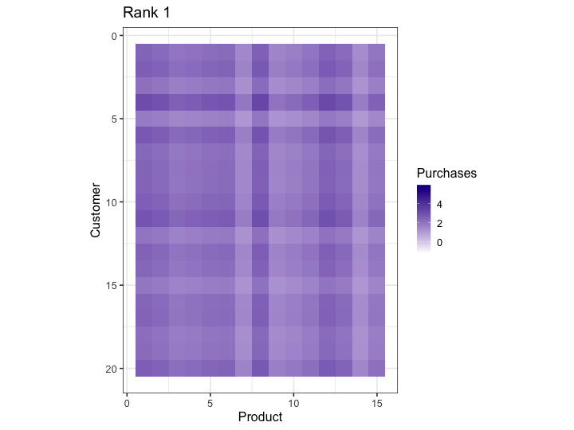

```{r}
#| include: false
library(tidyverse)
library(ggplot2)
library(patchwork)
set.seed(123)

# Example customer-product purchase matrix
customers <- paste0("C", 1:20)
products  <- paste0("P", 1:15)
M <- matrix(rpois(300, lambda = 2), nrow = 20, dimnames = list(customers, products))

hm <- function(M, title_txt) {
  tibble::as_tibble(M) |>
    dplyr::mutate(customer = row_number()) |>
    tidyr::pivot_longer(-customer, names_to = "product", values_to = "val") |>
    dplyr::mutate(product = as.integer(factor(product))) |>
    ggplot(aes(product, customer, fill = val)) +
    geom_tile() +
    scale_fill_gradient(low = "white", high = "darkblue") +
    scale_y_reverse() +
    coord_fixed() +
    labs(title = title_txt, x = "Product", y = "Customer", fill = "Purchases")
}
```

## 1. Business Problem

-   Firms collect large customer by product purchase data
-   Data is high dimensional and noisy
-   We want simpler views to see patterns and predict behavior

```{r}
hm(M, "Customer Product Purchases 20x15")
```

------------------------------------------------------------------------

## 2. SVD as Compression

-   SVD factors the matrix $M = U\Sigma V^\top$
-   $U,V$ have orthogonal columns, and $\Sigma$ is a diagonal matrix of singular values
    -   Keep the top k singular values for a rank $k$ summary
-   Interpretation:
    -   $U\Sigma$ gives customer preferences in reduced dimensions
    -   $V$ gives product features in reduced dimensions

------------------------------------------------------------------------

## 3. Low Rank Approximation

```{r}
sv <- svd(M)
Mk <- function(k) sv$u[,1:k, drop = FALSE] %*% diag(sv$d[1:k], k) %*% t(sv$v[,1:k, drop = FALSE])

p1 <- hm(Mk(2), "Rank 2 Approximation")
p2 <- hm(Mk(5), "Rank 5 Approximation")
p1 + p2
```

::: aside
Optional animation\
If you have gganimate run the next chunk to create a GIF that grows k\
If not skip and the deck will still knit
:::

```{r}
#| eval: false
# optional animation with gganimate
library(gganimate)
frames <- purrr::map_dfr(1:10, \(k) {
  as_tibble(Mk(k)) |>
    mutate(customer = row_number(), k = k) |>
    pivot_longer(-c(customer, k), names_to = "product", values_to = "val") |>
    mutate(product = as.integer(factor(product)))
})
g <- ggplot(frames, aes(product, customer, fill = val)) +
  geom_tile() +
  scale_fill_gradient(low = "white", high = "darkblue") +
  scale_y_reverse() +
  coord_fixed() +
  labs(title = "Rank {closest_state}", x = "Product", y = "Customer", fill = "Purchases") +
  transition_states(k, transition_length = 1, state_length = 1) + theme_bw(base_size = 16)
anim_save("images/biz_svd_rank_growth.gif", animate(g, nframes = 100, fps = 10, width = 720, height = 540))
```

```{r}
# show the gif if created
if (file.exists("images/biz_svd_rank_growth.gif")) 
```

------------------------------------------------------------------------

## 4. Business Uses

-   Customer segmentation with shared factors
-   Product recommendation by factor similarity
-   Forecasting with fewer and more stable features

```{r}
#| echo: true
#| code-fold: true
#| code-summary: plot of cumulatie variance explained
#| label: plot of cumulatie variance explained
var_expl <- sv$d^2 / sum(sv$d^2)
tibble::tibble(k = 1:length(var_expl), share = cumsum(var_expl)) |>
  ggplot(aes(k, share)) +
  geom_line() + geom_point() +
  scale_y_continuous(labels = scales::percent) +
  labs(title = "Cumulative Variance Explained", x = "Rank k", y = "Variance")
```

------------------------------------------------------------------------

## 5. Key Takeaways

-   SVD reduces dimension while keeping main patterns
-   Use small k for simple insights and speed
-   Increase k if accuracy matters more
