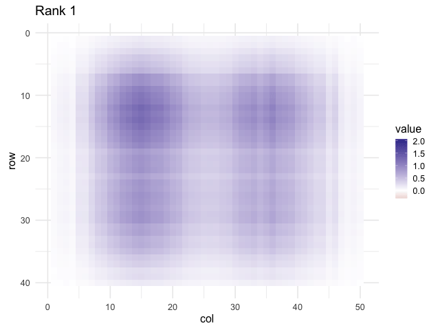

```{r}
#| include: false
library(tidyverse)
library(ggplot2)
theme_set(theme_minimal(base_size = 16))
set.seed(1)

# helper heatmap
hm <- function(M, title_txt = "") {
  as_tibble(M) |>
    mutate(r = row_number()) |>
    pivot_longer(-r, names_to = "c", values_to = "val") |>
    mutate(c = as.integer(gsub("V","", c))) |>
    ggplot(aes(c, r, fill = val)) +
    geom_tile() +
    scale_y_reverse() +
    scale_fill_gradient2() +
    labs(x = "col", y = "row", title = title_txt, fill = "value") +
    coord_fixed()
}
```

## 1. What SVD is

-   Every real matrix ($A \in \mathbb{R}^{m \times n}$) factors as $\left[ A = U\Sigma V^{\top} \right]$
-   $(U)$ has orthonormal columns. $(V)$ has orthonormal columns. $(\Sigma)$ is diagonal with nonnegative entries $(\sigma_1 \ge \cdots \ge \sigma_r)$
-   Rank is the number of nonzero singular values
-   Best low rank approximation comes from the top singular triplets

```{r}
# small numeric demo
A <- matrix(c(3,1,1,  -1,3,1,  0,1,3,  2,0,1,  1,2,0), nrow = 5, byrow = TRUE)
sv <- svd(A)
list(singular_values = round(sv$d, 3),
     first_left_singvec  = round(sv$u[,1], 3),
     first_right_singvec = round(sv$v[,1], 3))
```

------------------------------------------------------------------------

## 2. Geometry

-   $V$ rotates the input space
-   $\Sigma$ scales along orthogonal axes
-   $U$ rotates to the output space

```{r}
# ellipse picture from a 2D slice
Sig <- diag(c(3,1))
theta <- seq(0, 2*pi, length.out = 200)
circle <- rbind(cos(theta), sin(theta))
U2 <- svd(matrix(rnorm(4), 2, 2))$u
V2 <- svd(matrix(rnorm(4), 2, 2))$u
ellipse <- U2 %*% Sig %*% V2 %*% circle
par(mar = c(4,4,1,1))
plot(t(circle), type = "l", asp = 1, xlab = "x1", ylab = "x2")
lines(t(V2 %*% circle), lty = 2)
lines(t(Sig %*% V2 %*% circle), lty = 3)
lines(t(ellipse), lwd = 2)
legend("topright",
       c("unit circle", "after V", "after ΣV", "after UΣV"),
       lty = c(1,2,3,1), lwd = c(1,1,1,2), bty = "n")
```

------------------------------------------------------------------------

## 3. Low rank structure

-   A rank 1 matrix is an outer product ( $\sigma_1 u_1 v_1^{\top}$ )
-   Add more terms to sharpen detail
-   This gives the best rank (k) approximation in Frobenius norm

```{r}
# build a structured matrix then visualize approximations
m <- 40; n <- 50
grid <- expand.grid(i = 1:m, j = 1:n)
signal <- with(grid, 2*exp(-((i-12)^2+(j-15)^2)/(2*30)) +
                     1.5*exp(-((i-28)^2+(j-35)^2)/(2*50)))
noise <- matrix(rnorm(m*n, sd = 0.15), m, n)
M <- matrix(signal, m, n) + noise
svM <- svd(M)

Mk <- function(k) svM$u[,1:k,drop=FALSE] %*% diag(svM$d[1:k], k) %*% t(svM$v[,1:k,drop=FALSE])

hm(M, "Original")    # heatmap original
```

```{r}
# two side by side snapshots
library(patchwork)
p1 <- hm(Mk(1), "Rank 1")
p2 <- hm(Mk(5), "Rank 5")
p1 + p2
```

::: aside
If you have **gganimate**, run the next chunk to create a short GIF that grows (k).\
If not, skip it. The deck will still knit.
:::

```{r}
#| eval: false
# optional animation with gganimate
library(gganimate)
frames <- map_dfr(1:10, \(k) {
  as_tibble(Mk(k)) |>
    mutate(r = row_number(), k = k) |>
    pivot_longer(-c(r,k), names_to = "c", values_to = "val") |>
    mutate(c = as.integer(gsub("V","", c)))
})
g <- ggplot(frames, aes(c, r, fill = val)) +
  geom_tile() +
  scale_y_reverse() +
  scale_fill_gradient2() +
  coord_fixed() +
  labs(title = "Rank {closest_state}", x = "col", y = "row", fill = "value") +
  transition_states(k, transition_length = 1, state_length = 1) + theme_bw(base_size = 16)
anim_save("./slides/images/svd-rank-growth.gif", animate(g, nframes = 100, fps = 10, width = 640, height = 480))
```

```{r}
#| eval: true
# show the gif if created

```

------------------------------------------------------------------------

## 4. PCA link

-   Center the columns of (X)
-   PCA of (X) uses the SVD (X = U,\Sigma,V\^\top)
-   Scores are (U\Sigma). Loadings are (V)
-   Variance explained is (\sigma\_k\^2 / \sum\_j \sigma\_j\^2)

```{r}
X <- scale(mtcars, center = TRUE, scale = FALSE)
svx <- svd(X)
var_expl <- svx$d^2 / sum(svx$d^2)
tibble(PC = 1:length(var_expl), variance_explained = var_expl) |>
  ggplot(aes(PC, variance_explained)) +
  geom_col() +
  geom_line() +
  geom_point() +
  scale_y_continuous(labels = scales::percent) +
  labs(title = "Variance explained by PCs", x = "PC", y = "Share")
```

------------------------------------------------------------------------

## 5. Put it to work

-   Keep top (k) to denoise images or compress data
-   Solve least squares with (\Sigma\^+) for stability
-   Use truncated SVD in pipelines for speed

```{r}
# simple image denoise example on a grayscale block
img <- M
ps <- tibble(k = 1:10,
             frob = map_dbl(k, ~norm(img - Mk(.x), type = "F")))
ggplot(ps, aes(k, frob)) +
  geom_line() + geom_point() +
  labs(title = "Reconstruction error by rank", x = "rank k", y = "Frobenius norm")
```
